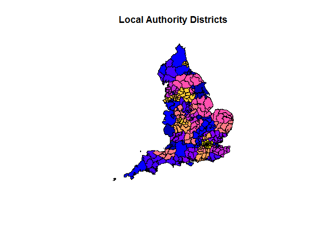

<!-- README.md is generated from README.Rmd. Please edit that file -->
Project management and overview documents for the Cycling Infrastructure Prioritisation Toolkit (CyIPT) Funded by the Department for Transport.

Comments/suggestions welcome in the [issue tracker](https://github.com/cyipt/cyipt/issues).

To get this and associated repos on you computer you can clone them as follows:

``` bash
clone git@github.com:cyipt/cyipt
clone git@github.com:cyipt/cyipt-bigdata
```

The main processes undertaken by CyIPT are:

-   Download OSM data by Local Authority (by default Bristol). See [download-osm.R](https://github.com/cyipt/cyipt/blob/master/scripts/prep_data/download-osm.R):

``` r
source("scripts/prep_data/download-osm.R")
#> Linking to GEOS 3.6.1, GDAL 2.2.0, proj.4 4.9.3
#> Data (c) OpenStreetMap contributors, ODbL 1.0. http://www.openstreetmap.org/copyright
```



    #> [1] "Skipping BristolCityof"

-   Clean OSM data that has been saved to `cyipt-bigdata`:

``` r
source("scripts/prep_data/clean_osm.R")
#> [1] "Doing NA at 2017-08-04 12:36:46"
#> [1] "Input File Missing"
#> [1] "Doing NA at 2017-08-04 12:36:46"
#> [1] "Input File Missing"
#> [1] "Doing  at 2017-08-04 12:36:46"
#> [1] "Input File Missing"
```

Definitions and variable names
------------------------------

Variable names are in lowercase and use\_underscores, and should be kept updated in [input-data/variables.csv](https://github.com/cyipt/cyipt/blob/master/input-data/variables.csv):

``` r
variables = readr::read_csv("input-data/variables.csv")
knitr::kable(variables)
```

| Variable name      | Definition                                                           |
|:-------------------|:---------------------------------------------------------------------|
| pcu                | Passenger Car Units per hour                                         |
| aadf               | Estimated annual average daily flows (disagregated by vehicle types) |
| aadt               | Estimated annual average traffic (vehicles)                          |
| all                | Total no. commuters                                                  |
| bicycle            | No. cyclists in Census 2011                                          |
| govtarget\_slc     | No. cyclists in Government Target                                    |
| dutch\_slc         | No. cyclists in Go Dutch                                             |
| msoa1              | Start or end zone 1, zone code                                       |
| msoa2              | Start or end zone 2, zone code                                       |
| car\_driver        | No. car drivers in Census 2011                                       |
| dist               | Straight line distance (km)                                          |
| dist\_fast         | Fast route distance (km)                                             |
| dist\_quiet        | Quiet route distance (km)                                            |
| cirquity           | Cirquity (fast distance / straight line distance)                    |
| distq\_f           | Quiet distance / fast distance                                       |
| av\_incline\_fast  | Average incline of fastest route                                     |
| av\_incline\_quiet | Average incline of quietest route                                    |
| time\_fast         | Time of fast route (s)                                               |
| time\_quiet        | Time of quiet route (s)                                              |
