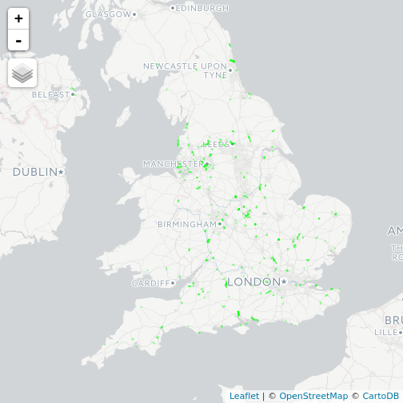
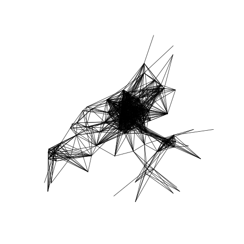

```r
# Aim: create predictive model of uptake of cycling following exposure to infrastructure
devtools::install_github("robinlovelace/ukboundaries")
```

```
## Skipping install of 'ukboundaries' from a github remote, the SHA1 (9297b3c1) has not changed since last install.
##   Use `force = TRUE` to force installation
```

```r
library(tmap)
tmap_mode("view")
```

```
## tmap mode set to interactive viewing
```

```r
library(ukboundaries)
library(tidyverse)
library(stplanr)
region_name = "Bristol"

# read-in data ----
lads = readRDS("../cyipt-bigdata/boundaries/local_authority/local_authority.Rds") %>%
  st_transform(4326)
z_msoa = msoa2011_vsimple %>%
  select(geo_code = msoa11cd)
# u_flow_11 = "https://github.com/npct/pct-outputs-national/raw/master/commute/msoa/l_all.Rds"
# download.file(u_flow_11, "~/npct/l_all.Rds")
# flow_11 = readRDS("~/npct/l_all.Rds") %>%
#   st_as_sf()
flow_11 = readRDS("~/npct/pct-outputs-regional-R/commute/msoa/avon/l.Rds") %>%
  as(Class = "sf")
c_oa01 = st_read("../cyipt-inputs-official/Output_Areas_December_2001_Population_Weighted_Centroids.shp") %>%
  st_transform(4326)
```

```
## Reading layer `Output_Areas_December_2001_Population_Weighted_Centroids' from data source `/home/robin/cyipt/cyipt-inputs-official/Output_Areas_December_2001_Population_Weighted_Centroids.shp' using driver `ESRI Shapefile'
## Simple feature collection with 175434 features and 3 fields
## geometry type:  POINT
## dimension:      XY
## bbox:           xmin: 87344.87 ymin: 10447.89 xmax: 655115.4 ymax: 654773.4
## epsg (SRID):    NA
## proj4string:    +proj=tmerc +lat_0=49 +lon_0=-2 +k=0.9996012717 +x_0=400000 +y_0=-100000 +datum=OSGB36 +units=m +no_defs
```

```r
aggzones = readRDS("../cyipt-bigdata/boundaries/TTWA/TTWA_England.Rds")
aggzone = filter(aggzones, ttwa11nm == region_name)
# aggzone = st_buffer(aggzones, dist = 0) # for all of UK
aggzone = flow_11 %>%
  st_transform(27700) %>%
  st_buffer(1000, 4) %>%
  st_union() %>%
  st_transform(4326)
plot(aggzone)
```


```r
# subset areal data to region and aggregate msoa-cas flows ----
c_oa01 = c_oa01[aggzone, ] # get points
```

```
## although coordinates are longitude/latitude, st_intersects assumes that they are planar
```

```r
z = z_msoa[c_oa01, ]
```

```
## although coordinates are longitude/latitude, st_intersects assumes that they are planar
```

```r
cas = cas[c_oa01, ]
```

```
## although coordinates are longitude/latitude, st_intersects assumes that they are planar
```

```r
cas = cas2003_simple[c_oa01, ]
```

```
## although coordinates are longitude/latitude, st_intersects assumes that they are planar
```

```r
# read-in and process infra data ----
sc2sd = readRDS("../cyinfdat/sc2sd") %>%
  filter(OpenDate < "2010-12-01") %>%
  mutate(OpenDate = as.character(OpenDate)) %>%
  select(date = OpenDate, on_road = OnRoad)
# all before 2011
sl2sc = readRDS("../cyinfdat/ri_04_11_dft") %>%
  select(date = BuildYear, on_road = OnRoad)
old_infra = rbind(sc2sd, sl2sc)
summary(as.factor(old_infra$on_road))
```

```
##    f    t 
## 1850  815
```

```r
qtm(old_infra, lines.col = "green")
```



```r
b = old_infra %>%
  st_transform(27700) %>%
  st_buffer(dist = 500, nQuadSegs = 4) %>%
  st_union() %>%
  st_transform(4326)
qtm(b)
```


```r
# subset lines of interest and aggregate them to cas level
# flow_11 = flow_11[b, ]
# cas = cas[b, ]
# z = z[b, ]

summary(flow_11$geo_code1 %in% z$geo_code)
```

```
##    Mode    TRUE 
## logical    4551
```

```r
f11 = select(flow_11, geo_code1, geo_code2, all, bicycle) %>%
  st_set_geometry(NULL) %>%
  filter(geo_code1 %in% z$geo_code, geo_code2 %in% z$geo_code) %>%
  filter(all > 20)
# time-consuming...
od_11 = od_aggregate(flow = f11, zones = z, aggzones = cas) %>%
  na.omit() %>%
  mutate(pcycle11 = bicycle / all) %>%
  select(o = flow_new_orig, d = flow_new_dest, all11 = all, pcycle11)
```

```
## Warning in st_centroid.sfc(st_geometry(x), of_largest_polygon =
## of_largest_polygon): st_centroid does not give correct centroids for
## longitude/latitude data

## Warning in st_centroid.sfc(st_geometry(x), of_largest_polygon =
## of_largest_polygon): st_centroid does not give correct centroids for
## longitude/latitude data
```

```
## although coordinates are longitude/latitude, st_intersects assumes that they are planar
```

```
## Joining, by = "geo_code1"
```

```
## Warning: Column `geo_code1` joining character vector and factor, coercing
## into character vector
```

```
## Joining, by = "geo_code2"
```

```
## Warning: Column `geo_code2` joining character vector and factor, coercing
## into character vector
```

```r
# process OD data ----
od_01 = read_csv("../cyoddata/wicid_output.csv", skip = 4, col_names = F)
```

```
## Parsed with column specification:
## cols(
##   X1 = col_character(),
##   X2 = col_character(),
##   X3 = col_integer(),
##   X4 = col_integer(),
##   X5 = col_integer(),
##   X6 = col_integer(),
##   X7 = col_integer()
## )
```

```
## Warning in rbind(names(probs), probs_f): number of columns of result is not
## a multiple of vector length (arg 1)
```

```
## Warning: 10 parsing failures.
## row # A tibble: 5 x 5 col      row col   expected               actual                     file      expected    <int> <chr> <chr>                  <chr>                      <chr>     actual 1 588862 <NA>  7 columns              2 columns                  '../cyod… file 2 588863 X3    an integer             Interaction data           '../cyod… row 3 588864 X3    no trailing characters " SWS Level 2"             '../cyod… col 4 588865 X3    an integer             [Table 3; Cell 1] Total;   '../cyod… expected 5 588865 X4    an integer             [Table 3; Cell 5] Method … '../cyod…
## ... ................. ... .......................................................................... ........ .......................................................................... ...... .......................................................................... .... .......................................................................... ... .......................................................................... ... .......................................................................... ........ ..........................................................................
## See problems(...) for more details.
```

```r
names(od_01) = c("o", "d", "all", "mfh", "car", "bicycle", "foot")
sum(od_01$all, na.rm = T) # 48.5 million
```

```
## [1] 48452156
```

```r
od_01$all = od_01$all - od_01$mfh
sum(od_01$all, na.rm = T) # 44 million
```

```
## [1] 43990536
```

```r
od_01$mfh = NULL

cas_codes = select(cas2003_simple, ons_label, name) %>%
  st_set_geometry(NULL) %>%
  filter(!duplicated(name), name %in% od_01$o | name %in% od_01$d)
# join-on the ons labels
od_01 = inner_join(od_01, select(cas_codes, ons_label_o = ons_label, o = name))
```

```
## Joining, by = "o"
```

```
## Warning: Column `o` joining character vector and factor, coercing into
## character vector
```

```r
sum(od_01$all, na.rm = T) # 44 million
```

```
## [1] 40857794
```

```r
od_01 = inner_join(od_01, select(cas_codes, ons_label_d = ons_label, d = name)) # removes ~20m ppl
```

```
## Joining, by = "d"
```

```
## Warning: Column `d` joining character vector and factor, coercing into
## character vector
```

```r
sum(od_01$all, na.rm = T) # 44 million
```

```
## [1] 23146182
```

```r
od_01$o = od_01$ons_label_o
od_01$d = od_01$ons_label_d
od_01 = od_01 %>% mutate(pcycle01 = bicycle / all) %>%
  select(o, d, pcycle01, all01 = all)

od_01_region = od_01 %>%
  filter(o %in% cas$ons_label, d %in% cas$ons_label) # 6k results

summary(od_01_region$o %in% od_11$o) # test readiness to merge with 2011
```

```
##    Mode   FALSE    TRUE 
## logical    7747   11949
```

```r
od_01_region = od_01_region %>%
  filter(all01 > 10, o %in% od_11$o, d %in% od_11$d) %>%
  na.omit()

od = inner_join(od_01_region, od_11)
```

```
## Joining, by = c("o", "d")
```

```r
od = mutate(od, p_uptake = (pcycle11 - pcycle01))

l = od2line(flow = od, cas)
```

```
## Warning in st_centroid.sfc(st_geometry(x), of_largest_polygon =
## of_largest_polygon): st_centroid does not give correct centroids for
## longitude/latitude data
```

```r
plot(l$geometry) # works
```



```r
l$dist = as.numeric(st_length(l))
l = filter(l, dist > 0, dist < 10000) %>%
  na.omit()
qtm(l) + qtm(b)
```


```r
# testing
sum(l$all01) # 100k
```

```
## [1] 85000
```

```r
sum(l$all11) # many more in 2011
```

```
## [1] 169105
```

```r
sum(l$all01 * l$pcycle01) / sum(l$all01)
```

```
## [1] 0.05449412
```

```r
sum(l$all11 * l$pcycle11) / sum(l$all11) # doubling in cycling in Avon in affected routes
```

```
## [1] 0.07816445
```

```r
# crude measure of exposure: % of route near 1 cycle path
i = 1
l$exposure = NA
for(i in 1:nrow(l)) {
  intersection = st_intersection(l$geometry[i], b)
  if(length(intersection) > 0) {
    l$exposure[i] = st_length(intersection) /
      st_length(l$geometry[i])
  }
}
```

```
## although coordinates are longitude/latitude, st_intersection assumes that they are planar
```

```
## although coordinates are longitude/latitude, st_intersection assumes that they are planar
## although coordinates are longitude/latitude, st_intersection assumes that they are planar
## although coordinates are longitude/latitude, st_intersection assumes that they are planar
## although coordinates are longitude/latitude, st_intersection assumes that they are planar
## although coordinates are longitude/latitude, st_intersection assumes that they are planar
## although coordinates are longitude/latitude, st_intersection assumes that they are planar
## although coordinates are longitude/latitude, st_intersection assumes that they are planar
## although coordinates are longitude/latitude, st_intersection assumes that they are planar
## although coordinates are longitude/latitude, st_intersection assumes that they are planar
## although coordinates are longitude/latitude, st_intersection assumes that they are planar
## although coordinates are longitude/latitude, st_intersection assumes that they are planar
## although coordinates are longitude/latitude, st_intersection assumes that they are planar
## although coordinates are longitude/latitude, st_intersection assumes that they are planar
## although coordinates are longitude/latitude, st_intersection assumes that they are planar
## although coordinates are longitude/latitude, st_intersection assumes that they are planar
## although coordinates are longitude/latitude, st_intersection assumes that they are planar
## although coordinates are longitude/latitude, st_intersection assumes that they are planar
## although coordinates are longitude/latitude, st_intersection assumes that they are planar
## although coordinates are longitude/latitude, st_intersection assumes that they are planar
## although coordinates are longitude/latitude, st_intersection assumes that they are planar
## although coordinates are longitude/latitude, st_intersection assumes that they are planar
## although coordinates are longitude/latitude, st_intersection assumes that they are planar
## although coordinates are longitude/latitude, st_intersection assumes that they are planar
## although coordinates are longitude/latitude, st_intersection assumes that they are planar
## although coordinates are longitude/latitude, st_intersection assumes that they are planar
## although coordinates are longitude/latitude, st_intersection assumes that they are planar
## although coordinates are longitude/latitude, st_intersection assumes that they are planar
## although coordinates are longitude/latitude, st_intersection assumes that they are planar
## although coordinates are longitude/latitude, st_intersection assumes that they are planar
## although coordinates are longitude/latitude, st_intersection assumes that they are planar
## although coordinates are longitude/latitude, st_intersection assumes that they are planar
## although coordinates are longitude/latitude, st_intersection assumes that they are planar
## although coordinates are longitude/latitude, st_intersection assumes that they are planar
## although coordinates are longitude/latitude, st_intersection assumes that they are planar
## although coordinates are longitude/latitude, st_intersection assumes that they are planar
## although coordinates are longitude/latitude, st_intersection assumes that they are planar
## although coordinates are longitude/latitude, st_intersection assumes that they are planar
## although coordinates are longitude/latitude, st_intersection assumes that they are planar
## although coordinates are longitude/latitude, st_intersection assumes that they are planar
## although coordinates are longitude/latitude, st_intersection assumes that they are planar
## although coordinates are longitude/latitude, st_intersection assumes that they are planar
## although coordinates are longitude/latitude, st_intersection assumes that they are planar
## although coordinates are longitude/latitude, st_intersection assumes that they are planar
## although coordinates are longitude/latitude, st_intersection assumes that they are planar
## although coordinates are longitude/latitude, st_intersection assumes that they are planar
## although coordinates are longitude/latitude, st_intersection assumes that they are planar
## although coordinates are longitude/latitude, st_intersection assumes that they are planar
## although coordinates are longitude/latitude, st_intersection assumes that they are planar
## although coordinates are longitude/latitude, st_intersection assumes that they are planar
## although coordinates are longitude/latitude, st_intersection assumes that they are planar
## although coordinates are longitude/latitude, st_intersection assumes that they are planar
## although coordinates are longitude/latitude, st_intersection assumes that they are planar
## although coordinates are longitude/latitude, st_intersection assumes that they are planar
## although coordinates are longitude/latitude, st_intersection assumes that they are planar
## although coordinates are longitude/latitude, st_intersection assumes that they are planar
## although coordinates are longitude/latitude, st_intersection assumes that they are planar
## although coordinates are longitude/latitude, st_intersection assumes that they are planar
## although coordinates are longitude/latitude, st_intersection assumes that they are planar
## although coordinates are longitude/latitude, st_intersection assumes that they are planar
## although coordinates are longitude/latitude, st_intersection assumes that they are planar
## although coordinates are longitude/latitude, st_intersection assumes that they are planar
## although coordinates are longitude/latitude, st_intersection assumes that they are planar
## although coordinates are longitude/latitude, st_intersection assumes that they are planar
## although coordinates are longitude/latitude, st_intersection assumes that they are planar
## although coordinates are longitude/latitude, st_intersection assumes that they are planar
## although coordinates are longitude/latitude, st_intersection assumes that they are planar
## although coordinates are longitude/latitude, st_intersection assumes that they are planar
## although coordinates are longitude/latitude, st_intersection assumes that they are planar
## although coordinates are longitude/latitude, st_intersection assumes that they are planar
## although coordinates are longitude/latitude, st_intersection assumes that they are planar
## although coordinates are longitude/latitude, st_intersection assumes that they are planar
## although coordinates are longitude/latitude, st_intersection assumes that they are planar
## although coordinates are longitude/latitude, st_intersection assumes that they are planar
## although coordinates are longitude/latitude, st_intersection assumes that they are planar
## although coordinates are longitude/latitude, st_intersection assumes that they are planar
## although coordinates are longitude/latitude, st_intersection assumes that they are planar
## although coordinates are longitude/latitude, st_intersection assumes that they are planar
## although coordinates are longitude/latitude, st_intersection assumes that they are planar
## although coordinates are longitude/latitude, st_intersection assumes that they are planar
## although coordinates are longitude/latitude, st_intersection assumes that they are planar
## although coordinates are longitude/latitude, st_intersection assumes that they are planar
## although coordinates are longitude/latitude, st_intersection assumes that they are planar
## although coordinates are longitude/latitude, st_intersection assumes that they are planar
## although coordinates are longitude/latitude, st_intersection assumes that they are planar
## although coordinates are longitude/latitude, st_intersection assumes that they are planar
## although coordinates are longitude/latitude, st_intersection assumes that they are planar
## although coordinates are longitude/latitude, st_intersection assumes that they are planar
## although coordinates are longitude/latitude, st_intersection assumes that they are planar
## although coordinates are longitude/latitude, st_intersection assumes that they are planar
## although coordinates are longitude/latitude, st_intersection assumes that they are planar
## although coordinates are longitude/latitude, st_intersection assumes that they are planar
## although coordinates are longitude/latitude, st_intersection assumes that they are planar
## although coordinates are longitude/latitude, st_intersection assumes that they are planar
## although coordinates are longitude/latitude, st_intersection assumes that they are planar
## although coordinates are longitude/latitude, st_intersection assumes that they are planar
## although coordinates are longitude/latitude, st_intersection assumes that they are planar
## although coordinates are longitude/latitude, st_intersection assumes that they are planar
## although coordinates are longitude/latitude, st_intersection assumes that they are planar
## although coordinates are longitude/latitude, st_intersection assumes that they are planar
## although coordinates are longitude/latitude, st_intersection assumes that they are planar
## although coordinates are longitude/latitude, st_intersection assumes that they are planar
## although coordinates are longitude/latitude, st_intersection assumes that they are planar
## although coordinates are longitude/latitude, st_intersection assumes that they are planar
## although coordinates are longitude/latitude, st_intersection assumes that they are planar
## although coordinates are longitude/latitude, st_intersection assumes that they are planar
## although coordinates are longitude/latitude, st_intersection assumes that they are planar
## although coordinates are longitude/latitude, st_intersection assumes that they are planar
## although coordinates are longitude/latitude, st_intersection assumes that they are planar
## although coordinates are longitude/latitude, st_intersection assumes that they are planar
## although coordinates are longitude/latitude, st_intersection assumes that they are planar
## although coordinates are longitude/latitude, st_intersection assumes that they are planar
## although coordinates are longitude/latitude, st_intersection assumes that they are planar
## although coordinates are longitude/latitude, st_intersection assumes that they are planar
## although coordinates are longitude/latitude, st_intersection assumes that they are planar
## although coordinates are longitude/latitude, st_intersection assumes that they are planar
## although coordinates are longitude/latitude, st_intersection assumes that they are planar
## although coordinates are longitude/latitude, st_intersection assumes that they are planar
## although coordinates are longitude/latitude, st_intersection assumes that they are planar
## although coordinates are longitude/latitude, st_intersection assumes that they are planar
## although coordinates are longitude/latitude, st_intersection assumes that they are planar
## although coordinates are longitude/latitude, st_intersection assumes that they are planar
## although coordinates are longitude/latitude, st_intersection assumes that they are planar
## although coordinates are longitude/latitude, st_intersection assumes that they are planar
## although coordinates are longitude/latitude, st_intersection assumes that they are planar
## although coordinates are longitude/latitude, st_intersection assumes that they are planar
## although coordinates are longitude/latitude, st_intersection assumes that they are planar
## although coordinates are longitude/latitude, st_intersection assumes that they are planar
## although coordinates are longitude/latitude, st_intersection assumes that they are planar
## although coordinates are longitude/latitude, st_intersection assumes that they are planar
## although coordinates are longitude/latitude, st_intersection assumes that they are planar
## although coordinates are longitude/latitude, st_intersection assumes that they are planar
## although coordinates are longitude/latitude, st_intersection assumes that they are planar
## although coordinates are longitude/latitude, st_intersection assumes that they are planar
## although coordinates are longitude/latitude, st_intersection assumes that they are planar
## although coordinates are longitude/latitude, st_intersection assumes that they are planar
## although coordinates are longitude/latitude, st_intersection assumes that they are planar
## although coordinates are longitude/latitude, st_intersection assumes that they are planar
## although coordinates are longitude/latitude, st_intersection assumes that they are planar
## although coordinates are longitude/latitude, st_intersection assumes that they are planar
## although coordinates are longitude/latitude, st_intersection assumes that they are planar
## although coordinates are longitude/latitude, st_intersection assumes that they are planar
## although coordinates are longitude/latitude, st_intersection assumes that they are planar
## although coordinates are longitude/latitude, st_intersection assumes that they are planar
## although coordinates are longitude/latitude, st_intersection assumes that they are planar
## although coordinates are longitude/latitude, st_intersection assumes that they are planar
## although coordinates are longitude/latitude, st_intersection assumes that they are planar
## although coordinates are longitude/latitude, st_intersection assumes that they are planar
## although coordinates are longitude/latitude, st_intersection assumes that they are planar
## although coordinates are longitude/latitude, st_intersection assumes that they are planar
## although coordinates are longitude/latitude, st_intersection assumes that they are planar
## although coordinates are longitude/latitude, st_intersection assumes that they are planar
## although coordinates are longitude/latitude, st_intersection assumes that they are planar
## although coordinates are longitude/latitude, st_intersection assumes that they are planar
## although coordinates are longitude/latitude, st_intersection assumes that they are planar
## although coordinates are longitude/latitude, st_intersection assumes that they are planar
## although coordinates are longitude/latitude, st_intersection assumes that they are planar
## although coordinates are longitude/latitude, st_intersection assumes that they are planar
## although coordinates are longitude/latitude, st_intersection assumes that they are planar
## although coordinates are longitude/latitude, st_intersection assumes that they are planar
## although coordinates are longitude/latitude, st_intersection assumes that they are planar
## although coordinates are longitude/latitude, st_intersection assumes that they are planar
## although coordinates are longitude/latitude, st_intersection assumes that they are planar
## although coordinates are longitude/latitude, st_intersection assumes that they are planar
## although coordinates are longitude/latitude, st_intersection assumes that they are planar
## although coordinates are longitude/latitude, st_intersection assumes that they are planar
## although coordinates are longitude/latitude, st_intersection assumes that they are planar
## although coordinates are longitude/latitude, st_intersection assumes that they are planar
## although coordinates are longitude/latitude, st_intersection assumes that they are planar
## although coordinates are longitude/latitude, st_intersection assumes that they are planar
## although coordinates are longitude/latitude, st_intersection assumes that they are planar
## although coordinates are longitude/latitude, st_intersection assumes that they are planar
## although coordinates are longitude/latitude, st_intersection assumes that they are planar
## although coordinates are longitude/latitude, st_intersection assumes that they are planar
## although coordinates are longitude/latitude, st_intersection assumes that they are planar
## although coordinates are longitude/latitude, st_intersection assumes that they are planar
## although coordinates are longitude/latitude, st_intersection assumes that they are planar
## although coordinates are longitude/latitude, st_intersection assumes that they are planar
## although coordinates are longitude/latitude, st_intersection assumes that they are planar
## although coordinates are longitude/latitude, st_intersection assumes that they are planar
## although coordinates are longitude/latitude, st_intersection assumes that they are planar
## although coordinates are longitude/latitude, st_intersection assumes that they are planar
## although coordinates are longitude/latitude, st_intersection assumes that they are planar
## although coordinates are longitude/latitude, st_intersection assumes that they are planar
## although coordinates are longitude/latitude, st_intersection assumes that they are planar
## although coordinates are longitude/latitude, st_intersection assumes that they are planar
## although coordinates are longitude/latitude, st_intersection assumes that they are planar
## although coordinates are longitude/latitude, st_intersection assumes that they are planar
## although coordinates are longitude/latitude, st_intersection assumes that they are planar
## although coordinates are longitude/latitude, st_intersection assumes that they are planar
## although coordinates are longitude/latitude, st_intersection assumes that they are planar
## although coordinates are longitude/latitude, st_intersection assumes that they are planar
## although coordinates are longitude/latitude, st_intersection assumes that they are planar
## although coordinates are longitude/latitude, st_intersection assumes that they are planar
## although coordinates are longitude/latitude, st_intersection assumes that they are planar
## although coordinates are longitude/latitude, st_intersection assumes that they are planar
## although coordinates are longitude/latitude, st_intersection assumes that they are planar
## although coordinates are longitude/latitude, st_intersection assumes that they are planar
## although coordinates are longitude/latitude, st_intersection assumes that they are planar
## although coordinates are longitude/latitude, st_intersection assumes that they are planar
## although coordinates are longitude/latitude, st_intersection assumes that they are planar
## although coordinates are longitude/latitude, st_intersection assumes that they are planar
## although coordinates are longitude/latitude, st_intersection assumes that they are planar
## although coordinates are longitude/latitude, st_intersection assumes that they are planar
## although coordinates are longitude/latitude, st_intersection assumes that they are planar
## although coordinates are longitude/latitude, st_intersection assumes that they are planar
## although coordinates are longitude/latitude, st_intersection assumes that they are planar
## although coordinates are longitude/latitude, st_intersection assumes that they are planar
## although coordinates are longitude/latitude, st_intersection assumes that they are planar
## although coordinates are longitude/latitude, st_intersection assumes that they are planar
## although coordinates are longitude/latitude, st_intersection assumes that they are planar
## although coordinates are longitude/latitude, st_intersection assumes that they are planar
## although coordinates are longitude/latitude, st_intersection assumes that they are planar
## although coordinates are longitude/latitude, st_intersection assumes that they are planar
## although coordinates are longitude/latitude, st_intersection assumes that they are planar
## although coordinates are longitude/latitude, st_intersection assumes that they are planar
## although coordinates are longitude/latitude, st_intersection assumes that they are planar
## although coordinates are longitude/latitude, st_intersection assumes that they are planar
## although coordinates are longitude/latitude, st_intersection assumes that they are planar
## although coordinates are longitude/latitude, st_intersection assumes that they are planar
## although coordinates are longitude/latitude, st_intersection assumes that they are planar
## although coordinates are longitude/latitude, st_intersection assumes that they are planar
## although coordinates are longitude/latitude, st_intersection assumes that they are planar
## although coordinates are longitude/latitude, st_intersection assumes that they are planar
## although coordinates are longitude/latitude, st_intersection assumes that they are planar
## although coordinates are longitude/latitude, st_intersection assumes that they are planar
## although coordinates are longitude/latitude, st_intersection assumes that they are planar
## although coordinates are longitude/latitude, st_intersection assumes that they are planar
## although coordinates are longitude/latitude, st_intersection assumes that they are planar
## although coordinates are longitude/latitude, st_intersection assumes that they are planar
## although coordinates are longitude/latitude, st_intersection assumes that they are planar
## although coordinates are longitude/latitude, st_intersection assumes that they are planar
## although coordinates are longitude/latitude, st_intersection assumes that they are planar
## although coordinates are longitude/latitude, st_intersection assumes that they are planar
## although coordinates are longitude/latitude, st_intersection assumes that they are planar
## although coordinates are longitude/latitude, st_intersection assumes that they are planar
## although coordinates are longitude/latitude, st_intersection assumes that they are planar
## although coordinates are longitude/latitude, st_intersection assumes that they are planar
## although coordinates are longitude/latitude, st_intersection assumes that they are planar
## although coordinates are longitude/latitude, st_intersection assumes that they are planar
## although coordinates are longitude/latitude, st_intersection assumes that they are planar
## although coordinates are longitude/latitude, st_intersection assumes that they are planar
## although coordinates are longitude/latitude, st_intersection assumes that they are planar
## although coordinates are longitude/latitude, st_intersection assumes that they are planar
## although coordinates are longitude/latitude, st_intersection assumes that they are planar
## although coordinates are longitude/latitude, st_intersection assumes that they are planar
## although coordinates are longitude/latitude, st_intersection assumes that they are planar
## although coordinates are longitude/latitude, st_intersection assumes that they are planar
## although coordinates are longitude/latitude, st_intersection assumes that they are planar
## although coordinates are longitude/latitude, st_intersection assumes that they are planar
## although coordinates are longitude/latitude, st_intersection assumes that they are planar
## although coordinates are longitude/latitude, st_intersection assumes that they are planar
## although coordinates are longitude/latitude, st_intersection assumes that they are planar
## although coordinates are longitude/latitude, st_intersection assumes that they are planar
## although coordinates are longitude/latitude, st_intersection assumes that they are planar
## although coordinates are longitude/latitude, st_intersection assumes that they are planar
## although coordinates are longitude/latitude, st_intersection assumes that they are planar
## although coordinates are longitude/latitude, st_intersection assumes that they are planar
## although coordinates are longitude/latitude, st_intersection assumes that they are planar
## although coordinates are longitude/latitude, st_intersection assumes that they are planar
## although coordinates are longitude/latitude, st_intersection assumes that they are planar
## although coordinates are longitude/latitude, st_intersection assumes that they are planar
## although coordinates are longitude/latitude, st_intersection assumes that they are planar
## although coordinates are longitude/latitude, st_intersection assumes that they are planar
## although coordinates are longitude/latitude, st_intersection assumes that they are planar
## although coordinates are longitude/latitude, st_intersection assumes that they are planar
## although coordinates are longitude/latitude, st_intersection assumes that they are planar
## although coordinates are longitude/latitude, st_intersection assumes that they are planar
## although coordinates are longitude/latitude, st_intersection assumes that they are planar
## although coordinates are longitude/latitude, st_intersection assumes that they are planar
## although coordinates are longitude/latitude, st_intersection assumes that they are planar
## although coordinates are longitude/latitude, st_intersection assumes that they are planar
## although coordinates are longitude/latitude, st_intersection assumes that they are planar
## although coordinates are longitude/latitude, st_intersection assumes that they are planar
## although coordinates are longitude/latitude, st_intersection assumes that they are planar
## although coordinates are longitude/latitude, st_intersection assumes that they are planar
## although coordinates are longitude/latitude, st_intersection assumes that they are planar
## although coordinates are longitude/latitude, st_intersection assumes that they are planar
## although coordinates are longitude/latitude, st_intersection assumes that they are planar
## although coordinates are longitude/latitude, st_intersection assumes that they are planar
## although coordinates are longitude/latitude, st_intersection assumes that they are planar
## although coordinates are longitude/latitude, st_intersection assumes that they are planar
## although coordinates are longitude/latitude, st_intersection assumes that they are planar
## although coordinates are longitude/latitude, st_intersection assumes that they are planar
## although coordinates are longitude/latitude, st_intersection assumes that they are planar
## although coordinates are longitude/latitude, st_intersection assumes that they are planar
## although coordinates are longitude/latitude, st_intersection assumes that they are planar
## although coordinates are longitude/latitude, st_intersection assumes that they are planar
## although coordinates are longitude/latitude, st_intersection assumes that they are planar
## although coordinates are longitude/latitude, st_intersection assumes that they are planar
## although coordinates are longitude/latitude, st_intersection assumes that they are planar
## although coordinates are longitude/latitude, st_intersection assumes that they are planar
## although coordinates are longitude/latitude, st_intersection assumes that they are planar
## although coordinates are longitude/latitude, st_intersection assumes that they are planar
## although coordinates are longitude/latitude, st_intersection assumes that they are planar
## although coordinates are longitude/latitude, st_intersection assumes that they are planar
## although coordinates are longitude/latitude, st_intersection assumes that they are planar
## although coordinates are longitude/latitude, st_intersection assumes that they are planar
## although coordinates are longitude/latitude, st_intersection assumes that they are planar
## although coordinates are longitude/latitude, st_intersection assumes that they are planar
## although coordinates are longitude/latitude, st_intersection assumes that they are planar
## although coordinates are longitude/latitude, st_intersection assumes that they are planar
## although coordinates are longitude/latitude, st_intersection assumes that they are planar
## although coordinates are longitude/latitude, st_intersection assumes that they are planar
## although coordinates are longitude/latitude, st_intersection assumes that they are planar
## although coordinates are longitude/latitude, st_intersection assumes that they are planar
## although coordinates are longitude/latitude, st_intersection assumes that they are planar
## although coordinates are longitude/latitude, st_intersection assumes that they are planar
## although coordinates are longitude/latitude, st_intersection assumes that they are planar
## although coordinates are longitude/latitude, st_intersection assumes that they are planar
## although coordinates are longitude/latitude, st_intersection assumes that they are planar
## although coordinates are longitude/latitude, st_intersection assumes that they are planar
## although coordinates are longitude/latitude, st_intersection assumes that they are planar
## although coordinates are longitude/latitude, st_intersection assumes that they are planar
## although coordinates are longitude/latitude, st_intersection assumes that they are planar
## although coordinates are longitude/latitude, st_intersection assumes that they are planar
## although coordinates are longitude/latitude, st_intersection assumes that they are planar
## although coordinates are longitude/latitude, st_intersection assumes that they are planar
## although coordinates are longitude/latitude, st_intersection assumes that they are planar
## although coordinates are longitude/latitude, st_intersection assumes that they are planar
## although coordinates are longitude/latitude, st_intersection assumes that they are planar
## although coordinates are longitude/latitude, st_intersection assumes that they are planar
## although coordinates are longitude/latitude, st_intersection assumes that they are planar
## although coordinates are longitude/latitude, st_intersection assumes that they are planar
## although coordinates are longitude/latitude, st_intersection assumes that they are planar
## although coordinates are longitude/latitude, st_intersection assumes that they are planar
## although coordinates are longitude/latitude, st_intersection assumes that they are planar
## although coordinates are longitude/latitude, st_intersection assumes that they are planar
## although coordinates are longitude/latitude, st_intersection assumes that they are planar
## although coordinates are longitude/latitude, st_intersection assumes that they are planar
## although coordinates are longitude/latitude, st_intersection assumes that they are planar
## although coordinates are longitude/latitude, st_intersection assumes that they are planar
## although coordinates are longitude/latitude, st_intersection assumes that they are planar
## although coordinates are longitude/latitude, st_intersection assumes that they are planar
## although coordinates are longitude/latitude, st_intersection assumes that they are planar
## although coordinates are longitude/latitude, st_intersection assumes that they are planar
## although coordinates are longitude/latitude, st_intersection assumes that they are planar
## although coordinates are longitude/latitude, st_intersection assumes that they are planar
## although coordinates are longitude/latitude, st_intersection assumes that they are planar
## although coordinates are longitude/latitude, st_intersection assumes that they are planar
## although coordinates are longitude/latitude, st_intersection assumes that they are planar
## although coordinates are longitude/latitude, st_intersection assumes that they are planar
## although coordinates are longitude/latitude, st_intersection assumes that they are planar
## although coordinates are longitude/latitude, st_intersection assumes that they are planar
## although coordinates are longitude/latitude, st_intersection assumes that they are planar
## although coordinates are longitude/latitude, st_intersection assumes that they are planar
## although coordinates are longitude/latitude, st_intersection assumes that they are planar
## although coordinates are longitude/latitude, st_intersection assumes that they are planar
## although coordinates are longitude/latitude, st_intersection assumes that they are planar
## although coordinates are longitude/latitude, st_intersection assumes that they are planar
## although coordinates are longitude/latitude, st_intersection assumes that they are planar
## although coordinates are longitude/latitude, st_intersection assumes that they are planar
## although coordinates are longitude/latitude, st_intersection assumes that they are planar
## although coordinates are longitude/latitude, st_intersection assumes that they are planar
## although coordinates are longitude/latitude, st_intersection assumes that they are planar
## although coordinates are longitude/latitude, st_intersection assumes that they are planar
## although coordinates are longitude/latitude, st_intersection assumes that they are planar
## although coordinates are longitude/latitude, st_intersection assumes that they are planar
## although coordinates are longitude/latitude, st_intersection assumes that they are planar
## although coordinates are longitude/latitude, st_intersection assumes that they are planar
## although coordinates are longitude/latitude, st_intersection assumes that they are planar
## although coordinates are longitude/latitude, st_intersection assumes that they are planar
## although coordinates are longitude/latitude, st_intersection assumes that they are planar
## although coordinates are longitude/latitude, st_intersection assumes that they are planar
## although coordinates are longitude/latitude, st_intersection assumes that they are planar
## although coordinates are longitude/latitude, st_intersection assumes that they are planar
## although coordinates are longitude/latitude, st_intersection assumes that they are planar
## although coordinates are longitude/latitude, st_intersection assumes that they are planar
## although coordinates are longitude/latitude, st_intersection assumes that they are planar
## although coordinates are longitude/latitude, st_intersection assumes that they are planar
## although coordinates are longitude/latitude, st_intersection assumes that they are planar
## although coordinates are longitude/latitude, st_intersection assumes that they are planar
## although coordinates are longitude/latitude, st_intersection assumes that they are planar
## although coordinates are longitude/latitude, st_intersection assumes that they are planar
## although coordinates are longitude/latitude, st_intersection assumes that they are planar
## although coordinates are longitude/latitude, st_intersection assumes that they are planar
## although coordinates are longitude/latitude, st_intersection assumes that they are planar
## although coordinates are longitude/latitude, st_intersection assumes that they are planar
## although coordinates are longitude/latitude, st_intersection assumes that they are planar
## although coordinates are longitude/latitude, st_intersection assumes that they are planar
## although coordinates are longitude/latitude, st_intersection assumes that they are planar
## although coordinates are longitude/latitude, st_intersection assumes that they are planar
## although coordinates are longitude/latitude, st_intersection assumes that they are planar
## although coordinates are longitude/latitude, st_intersection assumes that they are planar
## although coordinates are longitude/latitude, st_intersection assumes that they are planar
## although coordinates are longitude/latitude, st_intersection assumes that they are planar
## although coordinates are longitude/latitude, st_intersection assumes that they are planar
## although coordinates are longitude/latitude, st_intersection assumes that they are planar
## although coordinates are longitude/latitude, st_intersection assumes that they are planar
## although coordinates are longitude/latitude, st_intersection assumes that they are planar
## although coordinates are longitude/latitude, st_intersection assumes that they are planar
## although coordinates are longitude/latitude, st_intersection assumes that they are planar
## although coordinates are longitude/latitude, st_intersection assumes that they are planar
## although coordinates are longitude/latitude, st_intersection assumes that they are planar
## although coordinates are longitude/latitude, st_intersection assumes that they are planar
## although coordinates are longitude/latitude, st_intersection assumes that they are planar
## although coordinates are longitude/latitude, st_intersection assumes that they are planar
## although coordinates are longitude/latitude, st_intersection assumes that they are planar
## although coordinates are longitude/latitude, st_intersection assumes that they are planar
## although coordinates are longitude/latitude, st_intersection assumes that they are planar
## although coordinates are longitude/latitude, st_intersection assumes that they are planar
## although coordinates are longitude/latitude, st_intersection assumes that they are planar
## although coordinates are longitude/latitude, st_intersection assumes that they are planar
## although coordinates are longitude/latitude, st_intersection assumes that they are planar
## although coordinates are longitude/latitude, st_intersection assumes that they are planar
## although coordinates are longitude/latitude, st_intersection assumes that they are planar
## although coordinates are longitude/latitude, st_intersection assumes that they are planar
## although coordinates are longitude/latitude, st_intersection assumes that they are planar
## although coordinates are longitude/latitude, st_intersection assumes that they are planar
## although coordinates are longitude/latitude, st_intersection assumes that they are planar
## although coordinates are longitude/latitude, st_intersection assumes that they are planar
## although coordinates are longitude/latitude, st_intersection assumes that they are planar
## although coordinates are longitude/latitude, st_intersection assumes that they are planar
## although coordinates are longitude/latitude, st_intersection assumes that they are planar
## although coordinates are longitude/latitude, st_intersection assumes that they are planar
## although coordinates are longitude/latitude, st_intersection assumes that they are planar
## although coordinates are longitude/latitude, st_intersection assumes that they are planar
## although coordinates are longitude/latitude, st_intersection assumes that they are planar
## although coordinates are longitude/latitude, st_intersection assumes that they are planar
## although coordinates are longitude/latitude, st_intersection assumes that they are planar
## although coordinates are longitude/latitude, st_intersection assumes that they are planar
## although coordinates are longitude/latitude, st_intersection assumes that they are planar
## although coordinates are longitude/latitude, st_intersection assumes that they are planar
## although coordinates are longitude/latitude, st_intersection assumes that they are planar
## although coordinates are longitude/latitude, st_intersection assumes that they are planar
## although coordinates are longitude/latitude, st_intersection assumes that they are planar
## although coordinates are longitude/latitude, st_intersection assumes that they are planar
## although coordinates are longitude/latitude, st_intersection assumes that they are planar
## although coordinates are longitude/latitude, st_intersection assumes that they are planar
## although coordinates are longitude/latitude, st_intersection assumes that they are planar
## although coordinates are longitude/latitude, st_intersection assumes that they are planar
## although coordinates are longitude/latitude, st_intersection assumes that they are planar
## although coordinates are longitude/latitude, st_intersection assumes that they are planar
## although coordinates are longitude/latitude, st_intersection assumes that they are planar
## although coordinates are longitude/latitude, st_intersection assumes that they are planar
## although coordinates are longitude/latitude, st_intersection assumes that they are planar
## although coordinates are longitude/latitude, st_intersection assumes that they are planar
## although coordinates are longitude/latitude, st_intersection assumes that they are planar
## although coordinates are longitude/latitude, st_intersection assumes that they are planar
## although coordinates are longitude/latitude, st_intersection assumes that they are planar
## although coordinates are longitude/latitude, st_intersection assumes that they are planar
## although coordinates are longitude/latitude, st_intersection assumes that they are planar
## although coordinates are longitude/latitude, st_intersection assumes that they are planar
## although coordinates are longitude/latitude, st_intersection assumes that they are planar
## although coordinates are longitude/latitude, st_intersection assumes that they are planar
## although coordinates are longitude/latitude, st_intersection assumes that they are planar
## although coordinates are longitude/latitude, st_intersection assumes that they are planar
## although coordinates are longitude/latitude, st_intersection assumes that they are planar
## although coordinates are longitude/latitude, st_intersection assumes that they are planar
## although coordinates are longitude/latitude, st_intersection assumes that they are planar
## although coordinates are longitude/latitude, st_intersection assumes that they are planar
## although coordinates are longitude/latitude, st_intersection assumes that they are planar
## although coordinates are longitude/latitude, st_intersection assumes that they are planar
## although coordinates are longitude/latitude, st_intersection assumes that they are planar
## although coordinates are longitude/latitude, st_intersection assumes that they are planar
## although coordinates are longitude/latitude, st_intersection assumes that they are planar
## although coordinates are longitude/latitude, st_intersection assumes that they are planar
## although coordinates are longitude/latitude, st_intersection assumes that they are planar
## although coordinates are longitude/latitude, st_intersection assumes that they are planar
## although coordinates are longitude/latitude, st_intersection assumes that they are planar
## although coordinates are longitude/latitude, st_intersection assumes that they are planar
## although coordinates are longitude/latitude, st_intersection assumes that they are planar
## although coordinates are longitude/latitude, st_intersection assumes that they are planar
## although coordinates are longitude/latitude, st_intersection assumes that they are planar
## although coordinates are longitude/latitude, st_intersection assumes that they are planar
## although coordinates are longitude/latitude, st_intersection assumes that they are planar
## although coordinates are longitude/latitude, st_intersection assumes that they are planar
## although coordinates are longitude/latitude, st_intersection assumes that they are planar
## although coordinates are longitude/latitude, st_intersection assumes that they are planar
## although coordinates are longitude/latitude, st_intersection assumes that they are planar
## although coordinates are longitude/latitude, st_intersection assumes that they are planar
## although coordinates are longitude/latitude, st_intersection assumes that they are planar
## although coordinates are longitude/latitude, st_intersection assumes that they are planar
## although coordinates are longitude/latitude, st_intersection assumes that they are planar
## although coordinates are longitude/latitude, st_intersection assumes that they are planar
## although coordinates are longitude/latitude, st_intersection assumes that they are planar
## although coordinates are longitude/latitude, st_intersection assumes that they are planar
## although coordinates are longitude/latitude, st_intersection assumes that they are planar
## although coordinates are longitude/latitude, st_intersection assumes that they are planar
## although coordinates are longitude/latitude, st_intersection assumes that they are planar
## although coordinates are longitude/latitude, st_intersection assumes that they are planar
## although coordinates are longitude/latitude, st_intersection assumes that they are planar
## although coordinates are longitude/latitude, st_intersection assumes that they are planar
## although coordinates are longitude/latitude, st_intersection assumes that they are planar
## although coordinates are longitude/latitude, st_intersection assumes that they are planar
## although coordinates are longitude/latitude, st_intersection assumes that they are planar
## although coordinates are longitude/latitude, st_intersection assumes that they are planar
## although coordinates are longitude/latitude, st_intersection assumes that they are planar
## although coordinates are longitude/latitude, st_intersection assumes that they are planar
## although coordinates are longitude/latitude, st_intersection assumes that they are planar
## although coordinates are longitude/latitude, st_intersection assumes that they are planar
## although coordinates are longitude/latitude, st_intersection assumes that they are planar
## although coordinates are longitude/latitude, st_intersection assumes that they are planar
## although coordinates are longitude/latitude, st_intersection assumes that they are planar
## although coordinates are longitude/latitude, st_intersection assumes that they are planar
## although coordinates are longitude/latitude, st_intersection assumes that they are planar
## although coordinates are longitude/latitude, st_intersection assumes that they are planar
## although coordinates are longitude/latitude, st_intersection assumes that they are planar
## although coordinates are longitude/latitude, st_intersection assumes that they are planar
## although coordinates are longitude/latitude, st_intersection assumes that they are planar
## although coordinates are longitude/latitude, st_intersection assumes that they are planar
## although coordinates are longitude/latitude, st_intersection assumes that they are planar
## although coordinates are longitude/latitude, st_intersection assumes that they are planar
## although coordinates are longitude/latitude, st_intersection assumes that they are planar
## although coordinates are longitude/latitude, st_intersection assumes that they are planar
## although coordinates are longitude/latitude, st_intersection assumes that they are planar
## although coordinates are longitude/latitude, st_intersection assumes that they are planar
## although coordinates are longitude/latitude, st_intersection assumes that they are planar
## although coordinates are longitude/latitude, st_intersection assumes that they are planar
## although coordinates are longitude/latitude, st_intersection assumes that they are planar
## although coordinates are longitude/latitude, st_intersection assumes that they are planar
## although coordinates are longitude/latitude, st_intersection assumes that they are planar
## although coordinates are longitude/latitude, st_intersection assumes that they are planar
## although coordinates are longitude/latitude, st_intersection assumes that they are planar
## although coordinates are longitude/latitude, st_intersection assumes that they are planar
## although coordinates are longitude/latitude, st_intersection assumes that they are planar
## although coordinates are longitude/latitude, st_intersection assumes that they are planar
## although coordinates are longitude/latitude, st_intersection assumes that they are planar
## although coordinates are longitude/latitude, st_intersection assumes that they are planar
## although coordinates are longitude/latitude, st_intersection assumes that they are planar
## although coordinates are longitude/latitude, st_intersection assumes that they are planar
## although coordinates are longitude/latitude, st_intersection assumes that they are planar
## although coordinates are longitude/latitude, st_intersection assumes that they are planar
## although coordinates are longitude/latitude, st_intersection assumes that they are planar
## although coordinates are longitude/latitude, st_intersection assumes that they are planar
## although coordinates are longitude/latitude, st_intersection assumes that they are planar
## although coordinates are longitude/latitude, st_intersection assumes that they are planar
## although coordinates are longitude/latitude, st_intersection assumes that they are planar
## although coordinates are longitude/latitude, st_intersection assumes that they are planar
## although coordinates are longitude/latitude, st_intersection assumes that they are planar
## although coordinates are longitude/latitude, st_intersection assumes that they are planar
## although coordinates are longitude/latitude, st_intersection assumes that they are planar
## although coordinates are longitude/latitude, st_intersection assumes that they are planar
## although coordinates are longitude/latitude, st_intersection assumes that they are planar
## although coordinates are longitude/latitude, st_intersection assumes that they are planar
## although coordinates are longitude/latitude, st_intersection assumes that they are planar
## although coordinates are longitude/latitude, st_intersection assumes that they are planar
## although coordinates are longitude/latitude, st_intersection assumes that they are planar
## although coordinates are longitude/latitude, st_intersection assumes that they are planar
## although coordinates are longitude/latitude, st_intersection assumes that they are planar
## although coordinates are longitude/latitude, st_intersection assumes that they are planar
## although coordinates are longitude/latitude, st_intersection assumes that they are planar
## although coordinates are longitude/latitude, st_intersection assumes that they are planar
## although coordinates are longitude/latitude, st_intersection assumes that they are planar
## although coordinates are longitude/latitude, st_intersection assumes that they are planar
## although coordinates are longitude/latitude, st_intersection assumes that they are planar
## although coordinates are longitude/latitude, st_intersection assumes that they are planar
## although coordinates are longitude/latitude, st_intersection assumes that they are planar
## although coordinates are longitude/latitude, st_intersection assumes that they are planar
## although coordinates are longitude/latitude, st_intersection assumes that they are planar
## although coordinates are longitude/latitude, st_intersection assumes that they are planar
## although coordinates are longitude/latitude, st_intersection assumes that they are planar
## although coordinates are longitude/latitude, st_intersection assumes that they are planar
## although coordinates are longitude/latitude, st_intersection assumes that they are planar
## although coordinates are longitude/latitude, st_intersection assumes that they are planar
## although coordinates are longitude/latitude, st_intersection assumes that they are planar
## although coordinates are longitude/latitude, st_intersection assumes that they are planar
## although coordinates are longitude/latitude, st_intersection assumes that they are planar
## although coordinates are longitude/latitude, st_intersection assumes that they are planar
## although coordinates are longitude/latitude, st_intersection assumes that they are planar
## although coordinates are longitude/latitude, st_intersection assumes that they are planar
## although coordinates are longitude/latitude, st_intersection assumes that they are planar
## although coordinates are longitude/latitude, st_intersection assumes that they are planar
## although coordinates are longitude/latitude, st_intersection assumes that they are planar
## although coordinates are longitude/latitude, st_intersection assumes that they are planar
## although coordinates are longitude/latitude, st_intersection assumes that they are planar
## although coordinates are longitude/latitude, st_intersection assumes that they are planar
## although coordinates are longitude/latitude, st_intersection assumes that they are planar
## although coordinates are longitude/latitude, st_intersection assumes that they are planar
## although coordinates are longitude/latitude, st_intersection assumes that they are planar
## although coordinates are longitude/latitude, st_intersection assumes that they are planar
## although coordinates are longitude/latitude, st_intersection assumes that they are planar
## although coordinates are longitude/latitude, st_intersection assumes that they are planar
## although coordinates are longitude/latitude, st_intersection assumes that they are planar
## although coordinates are longitude/latitude, st_intersection assumes that they are planar
## although coordinates are longitude/latitude, st_intersection assumes that they are planar
## although coordinates are longitude/latitude, st_intersection assumes that they are planar
## although coordinates are longitude/latitude, st_intersection assumes that they are planar
## although coordinates are longitude/latitude, st_intersection assumes that they are planar
## although coordinates are longitude/latitude, st_intersection assumes that they are planar
## although coordinates are longitude/latitude, st_intersection assumes that they are planar
## although coordinates are longitude/latitude, st_intersection assumes that they are planar
## although coordinates are longitude/latitude, st_intersection assumes that they are planar
## although coordinates are longitude/latitude, st_intersection assumes that they are planar
## although coordinates are longitude/latitude, st_intersection assumes that they are planar
## although coordinates are longitude/latitude, st_intersection assumes that they are planar
## although coordinates are longitude/latitude, st_intersection assumes that they are planar
## although coordinates are longitude/latitude, st_intersection assumes that they are planar
## although coordinates are longitude/latitude, st_intersection assumes that they are planar
## although coordinates are longitude/latitude, st_intersection assumes that they are planar
## although coordinates are longitude/latitude, st_intersection assumes that they are planar
## although coordinates are longitude/latitude, st_intersection assumes that they are planar
## although coordinates are longitude/latitude, st_intersection assumes that they are planar
## although coordinates are longitude/latitude, st_intersection assumes that they are planar
## although coordinates are longitude/latitude, st_intersection assumes that they are planar
## although coordinates are longitude/latitude, st_intersection assumes that they are planar
## although coordinates are longitude/latitude, st_intersection assumes that they are planar
## although coordinates are longitude/latitude, st_intersection assumes that they are planar
## although coordinates are longitude/latitude, st_intersection assumes that they are planar
## although coordinates are longitude/latitude, st_intersection assumes that they are planar
## although coordinates are longitude/latitude, st_intersection assumes that they are planar
## although coordinates are longitude/latitude, st_intersection assumes that they are planar
## although coordinates are longitude/latitude, st_intersection assumes that they are planar
## although coordinates are longitude/latitude, st_intersection assumes that they are planar
## although coordinates are longitude/latitude, st_intersection assumes that they are planar
## although coordinates are longitude/latitude, st_intersection assumes that they are planar
## although coordinates are longitude/latitude, st_intersection assumes that they are planar
## although coordinates are longitude/latitude, st_intersection assumes that they are planar
## although coordinates are longitude/latitude, st_intersection assumes that they are planar
## although coordinates are longitude/latitude, st_intersection assumes that they are planar
## although coordinates are longitude/latitude, st_intersection assumes that they are planar
## although coordinates are longitude/latitude, st_intersection assumes that they are planar
## although coordinates are longitude/latitude, st_intersection assumes that they are planar
## although coordinates are longitude/latitude, st_intersection assumes that they are planar
## although coordinates are longitude/latitude, st_intersection assumes that they are planar
## although coordinates are longitude/latitude, st_intersection assumes that they are planar
## although coordinates are longitude/latitude, st_intersection assumes that they are planar
## although coordinates are longitude/latitude, st_intersection assumes that they are planar
## although coordinates are longitude/latitude, st_intersection assumes that they are planar
## although coordinates are longitude/latitude, st_intersection assumes that they are planar
## although coordinates are longitude/latitude, st_intersection assumes that they are planar
## although coordinates are longitude/latitude, st_intersection assumes that they are planar
## although coordinates are longitude/latitude, st_intersection assumes that they are planar
## although coordinates are longitude/latitude, st_intersection assumes that they are planar
## although coordinates are longitude/latitude, st_intersection assumes that they are planar
## although coordinates are longitude/latitude, st_intersection assumes that they are planar
## although coordinates are longitude/latitude, st_intersection assumes that they are planar
## although coordinates are longitude/latitude, st_intersection assumes that they are planar
## although coordinates are longitude/latitude, st_intersection assumes that they are planar
## although coordinates are longitude/latitude, st_intersection assumes that they are planar
## although coordinates are longitude/latitude, st_intersection assumes that they are planar
## although coordinates are longitude/latitude, st_intersection assumes that they are planar
## although coordinates are longitude/latitude, st_intersection assumes that they are planar
## although coordinates are longitude/latitude, st_intersection assumes that they are planar
## although coordinates are longitude/latitude, st_intersection assumes that they are planar
## although coordinates are longitude/latitude, st_intersection assumes that they are planar
## although coordinates are longitude/latitude, st_intersection assumes that they are planar
## although coordinates are longitude/latitude, st_intersection assumes that they are planar
## although coordinates are longitude/latitude, st_intersection assumes that they are planar
## although coordinates are longitude/latitude, st_intersection assumes that they are planar
## although coordinates are longitude/latitude, st_intersection assumes that they are planar
## although coordinates are longitude/latitude, st_intersection assumes that they are planar
## although coordinates are longitude/latitude, st_intersection assumes that they are planar
## although coordinates are longitude/latitude, st_intersection assumes that they are planar
## although coordinates are longitude/latitude, st_intersection assumes that they are planar
## although coordinates are longitude/latitude, st_intersection assumes that they are planar
## although coordinates are longitude/latitude, st_intersection assumes that they are planar
## although coordinates are longitude/latitude, st_intersection assumes that they are planar
## although coordinates are longitude/latitude, st_intersection assumes that they are planar
## although coordinates are longitude/latitude, st_intersection assumes that they are planar
## although coordinates are longitude/latitude, st_intersection assumes that they are planar
## although coordinates are longitude/latitude, st_intersection assumes that they are planar
## although coordinates are longitude/latitude, st_intersection assumes that they are planar
## although coordinates are longitude/latitude, st_intersection assumes that they are planar
## although coordinates are longitude/latitude, st_intersection assumes that they are planar
## although coordinates are longitude/latitude, st_intersection assumes that they are planar
## although coordinates are longitude/latitude, st_intersection assumes that they are planar
## although coordinates are longitude/latitude, st_intersection assumes that they are planar
## although coordinates are longitude/latitude, st_intersection assumes that they are planar
## although coordinates are longitude/latitude, st_intersection assumes that they are planar
## although coordinates are longitude/latitude, st_intersection assumes that they are planar
## although coordinates are longitude/latitude, st_intersection assumes that they are planar
## although coordinates are longitude/latitude, st_intersection assumes that they are planar
## although coordinates are longitude/latitude, st_intersection assumes that they are planar
## although coordinates are longitude/latitude, st_intersection assumes that they are planar
## although coordinates are longitude/latitude, st_intersection assumes that they are planar
## although coordinates are longitude/latitude, st_intersection assumes that they are planar
## although coordinates are longitude/latitude, st_intersection assumes that they are planar
## although coordinates are longitude/latitude, st_intersection assumes that they are planar
## although coordinates are longitude/latitude, st_intersection assumes that they are planar
## although coordinates are longitude/latitude, st_intersection assumes that they are planar
## although coordinates are longitude/latitude, st_intersection assumes that they are planar
## although coordinates are longitude/latitude, st_intersection assumes that they are planar
## although coordinates are longitude/latitude, st_intersection assumes that they are planar
## although coordinates are longitude/latitude, st_intersection assumes that they are planar
## although coordinates are longitude/latitude, st_intersection assumes that they are planar
## although coordinates are longitude/latitude, st_intersection assumes that they are planar
## although coordinates are longitude/latitude, st_intersection assumes that they are planar
## although coordinates are longitude/latitude, st_intersection assumes that they are planar
## although coordinates are longitude/latitude, st_intersection assumes that they are planar
## although coordinates are longitude/latitude, st_intersection assumes that they are planar
## although coordinates are longitude/latitude, st_intersection assumes that they are planar
## although coordinates are longitude/latitude, st_intersection assumes that they are planar
## although coordinates are longitude/latitude, st_intersection assumes that they are planar
## although coordinates are longitude/latitude, st_intersection assumes that they are planar
## although coordinates are longitude/latitude, st_intersection assumes that they are planar
## although coordinates are longitude/latitude, st_intersection assumes that they are planar
## although coordinates are longitude/latitude, st_intersection assumes that they are planar
## although coordinates are longitude/latitude, st_intersection assumes that they are planar
## although coordinates are longitude/latitude, st_intersection assumes that they are planar
## although coordinates are longitude/latitude, st_intersection assumes that they are planar
## although coordinates are longitude/latitude, st_intersection assumes that they are planar
## although coordinates are longitude/latitude, st_intersection assumes that they are planar
## although coordinates are longitude/latitude, st_intersection assumes that they are planar
## although coordinates are longitude/latitude, st_intersection assumes that they are planar
## although coordinates are longitude/latitude, st_intersection assumes that they are planar
## although coordinates are longitude/latitude, st_intersection assumes that they are planar
## although coordinates are longitude/latitude, st_intersection assumes that they are planar
## although coordinates are longitude/latitude, st_intersection assumes that they are planar
## although coordinates are longitude/latitude, st_intersection assumes that they are planar
## although coordinates are longitude/latitude, st_intersection assumes that they are planar
## although coordinates are longitude/latitude, st_intersection assumes that they are planar
## although coordinates are longitude/latitude, st_intersection assumes that they are planar
## although coordinates are longitude/latitude, st_intersection assumes that they are planar
## although coordinates are longitude/latitude, st_intersection assumes that they are planar
## although coordinates are longitude/latitude, st_intersection assumes that they are planar
## although coordinates are longitude/latitude, st_intersection assumes that they are planar
## although coordinates are longitude/latitude, st_intersection assumes that they are planar
## although coordinates are longitude/latitude, st_intersection assumes that they are planar
## although coordinates are longitude/latitude, st_intersection assumes that they are planar
## although coordinates are longitude/latitude, st_intersection assumes that they are planar
## although coordinates are longitude/latitude, st_intersection assumes that they are planar
## although coordinates are longitude/latitude, st_intersection assumes that they are planar
## although coordinates are longitude/latitude, st_intersection assumes that they are planar
## although coordinates are longitude/latitude, st_intersection assumes that they are planar
## although coordinates are longitude/latitude, st_intersection assumes that they are planar
## although coordinates are longitude/latitude, st_intersection assumes that they are planar
## although coordinates are longitude/latitude, st_intersection assumes that they are planar
## although coordinates are longitude/latitude, st_intersection assumes that they are planar
## although coordinates are longitude/latitude, st_intersection assumes that they are planar
## although coordinates are longitude/latitude, st_intersection assumes that they are planar
## although coordinates are longitude/latitude, st_intersection assumes that they are planar
## although coordinates are longitude/latitude, st_intersection assumes that they are planar
## although coordinates are longitude/latitude, st_intersection assumes that they are planar
## although coordinates are longitude/latitude, st_intersection assumes that they are planar
## although coordinates are longitude/latitude, st_intersection assumes that they are planar
## although coordinates are longitude/latitude, st_intersection assumes that they are planar
## although coordinates are longitude/latitude, st_intersection assumes that they are planar
## although coordinates are longitude/latitude, st_intersection assumes that they are planar
## although coordinates are longitude/latitude, st_intersection assumes that they are planar
## although coordinates are longitude/latitude, st_intersection assumes that they are planar
## although coordinates are longitude/latitude, st_intersection assumes that they are planar
## although coordinates are longitude/latitude, st_intersection assumes that they are planar
## although coordinates are longitude/latitude, st_intersection assumes that they are planar
## although coordinates are longitude/latitude, st_intersection assumes that they are planar
## although coordinates are longitude/latitude, st_intersection assumes that they are planar
## although coordinates are longitude/latitude, st_intersection assumes that they are planar
## although coordinates are longitude/latitude, st_intersection assumes that they are planar
## although coordinates are longitude/latitude, st_intersection assumes that they are planar
## although coordinates are longitude/latitude, st_intersection assumes that they are planar
## although coordinates are longitude/latitude, st_intersection assumes that they are planar
## although coordinates are longitude/latitude, st_intersection assumes that they are planar
## although coordinates are longitude/latitude, st_intersection assumes that they are planar
## although coordinates are longitude/latitude, st_intersection assumes that they are planar
## although coordinates are longitude/latitude, st_intersection assumes that they are planar
## although coordinates are longitude/latitude, st_intersection assumes that they are planar
## although coordinates are longitude/latitude, st_intersection assumes that they are planar
## although coordinates are longitude/latitude, st_intersection assumes that they are planar
## although coordinates are longitude/latitude, st_intersection assumes that they are planar
## although coordinates are longitude/latitude, st_intersection assumes that they are planar
## although coordinates are longitude/latitude, st_intersection assumes that they are planar
## although coordinates are longitude/latitude, st_intersection assumes that they are planar
## although coordinates are longitude/latitude, st_intersection assumes that they are planar
## although coordinates are longitude/latitude, st_intersection assumes that they are planar
## although coordinates are longitude/latitude, st_intersection assumes that they are planar
## although coordinates are longitude/latitude, st_intersection assumes that they are planar
## although coordinates are longitude/latitude, st_intersection assumes that they are planar
## although coordinates are longitude/latitude, st_intersection assumes that they are planar
## although coordinates are longitude/latitude, st_intersection assumes that they are planar
## although coordinates are longitude/latitude, st_intersection assumes that they are planar
## although coordinates are longitude/latitude, st_intersection assumes that they are planar
## although coordinates are longitude/latitude, st_intersection assumes that they are planar
## although coordinates are longitude/latitude, st_intersection assumes that they are planar
## although coordinates are longitude/latitude, st_intersection assumes that they are planar
## although coordinates are longitude/latitude, st_intersection assumes that they are planar
## although coordinates are longitude/latitude, st_intersection assumes that they are planar
## although coordinates are longitude/latitude, st_intersection assumes that they are planar
## although coordinates are longitude/latitude, st_intersection assumes that they are planar
## although coordinates are longitude/latitude, st_intersection assumes that they are planar
## although coordinates are longitude/latitude, st_intersection assumes that they are planar
## although coordinates are longitude/latitude, st_intersection assumes that they are planar
## although coordinates are longitude/latitude, st_intersection assumes that they are planar
## although coordinates are longitude/latitude, st_intersection assumes that they are planar
## although coordinates are longitude/latitude, st_intersection assumes that they are planar
## although coordinates are longitude/latitude, st_intersection assumes that they are planar
## although coordinates are longitude/latitude, st_intersection assumes that they are planar
## although coordinates are longitude/latitude, st_intersection assumes that they are planar
## although coordinates are longitude/latitude, st_intersection assumes that they are planar
## although coordinates are longitude/latitude, st_intersection assumes that they are planar
## although coordinates are longitude/latitude, st_intersection assumes that they are planar
## although coordinates are longitude/latitude, st_intersection assumes that they are planar
## although coordinates are longitude/latitude, st_intersection assumes that they are planar
## although coordinates are longitude/latitude, st_intersection assumes that they are planar
## although coordinates are longitude/latitude, st_intersection assumes that they are planar
## although coordinates are longitude/latitude, st_intersection assumes that they are planar
## although coordinates are longitude/latitude, st_intersection assumes that they are planar
## although coordinates are longitude/latitude, st_intersection assumes that they are planar
## although coordinates are longitude/latitude, st_intersection assumes that they are planar
## although coordinates are longitude/latitude, st_intersection assumes that they are planar
## although coordinates are longitude/latitude, st_intersection assumes that they are planar
## although coordinates are longitude/latitude, st_intersection assumes that they are planar
## although coordinates are longitude/latitude, st_intersection assumes that they are planar
## although coordinates are longitude/latitude, st_intersection assumes that they are planar
## although coordinates are longitude/latitude, st_intersection assumes that they are planar
## although coordinates are longitude/latitude, st_intersection assumes that they are planar
## although coordinates are longitude/latitude, st_intersection assumes that they are planar
## although coordinates are longitude/latitude, st_intersection assumes that they are planar
## although coordinates are longitude/latitude, st_intersection assumes that they are planar
## although coordinates are longitude/latitude, st_intersection assumes that they are planar
## although coordinates are longitude/latitude, st_intersection assumes that they are planar
## although coordinates are longitude/latitude, st_intersection assumes that they are planar
## although coordinates are longitude/latitude, st_intersection assumes that they are planar
## although coordinates are longitude/latitude, st_intersection assumes that they are planar
## although coordinates are longitude/latitude, st_intersection assumes that they are planar
## although coordinates are longitude/latitude, st_intersection assumes that they are planar
## although coordinates are longitude/latitude, st_intersection assumes that they are planar
## although coordinates are longitude/latitude, st_intersection assumes that they are planar
## although coordinates are longitude/latitude, st_intersection assumes that they are planar
## although coordinates are longitude/latitude, st_intersection assumes that they are planar
## although coordinates are longitude/latitude, st_intersection assumes that they are planar
## although coordinates are longitude/latitude, st_intersection assumes that they are planar
## although coordinates are longitude/latitude, st_intersection assumes that they are planar
## although coordinates are longitude/latitude, st_intersection assumes that they are planar
## although coordinates are longitude/latitude, st_intersection assumes that they are planar
## although coordinates are longitude/latitude, st_intersection assumes that they are planar
## although coordinates are longitude/latitude, st_intersection assumes that they are planar
## although coordinates are longitude/latitude, st_intersection assumes that they are planar
## although coordinates are longitude/latitude, st_intersection assumes that they are planar
## although coordinates are longitude/latitude, st_intersection assumes that they are planar
## although coordinates are longitude/latitude, st_intersection assumes that they are planar
## although coordinates are longitude/latitude, st_intersection assumes that they are planar
## although coordinates are longitude/latitude, st_intersection assumes that they are planar
## although coordinates are longitude/latitude, st_intersection assumes that they are planar
## although coordinates are longitude/latitude, st_intersection assumes that they are planar
## although coordinates are longitude/latitude, st_intersection assumes that they are planar
## although coordinates are longitude/latitude, st_intersection assumes that they are planar
## although coordinates are longitude/latitude, st_intersection assumes that they are planar
## although coordinates are longitude/latitude, st_intersection assumes that they are planar
## although coordinates are longitude/latitude, st_intersection assumes that they are planar
## although coordinates are longitude/latitude, st_intersection assumes that they are planar
## although coordinates are longitude/latitude, st_intersection assumes that they are planar
## although coordinates are longitude/latitude, st_intersection assumes that they are planar
## although coordinates are longitude/latitude, st_intersection assumes that they are planar
## although coordinates are longitude/latitude, st_intersection assumes that they are planar
## although coordinates are longitude/latitude, st_intersection assumes that they are planar
## although coordinates are longitude/latitude, st_intersection assumes that they are planar
## although coordinates are longitude/latitude, st_intersection assumes that they are planar
## although coordinates are longitude/latitude, st_intersection assumes that they are planar
## although coordinates are longitude/latitude, st_intersection assumes that they are planar
## although coordinates are longitude/latitude, st_intersection assumes that they are planar
## although coordinates are longitude/latitude, st_intersection assumes that they are planar
## although coordinates are longitude/latitude, st_intersection assumes that they are planar
## although coordinates are longitude/latitude, st_intersection assumes that they are planar
## although coordinates are longitude/latitude, st_intersection assumes that they are planar
## although coordinates are longitude/latitude, st_intersection assumes that they are planar
## although coordinates are longitude/latitude, st_intersection assumes that they are planar
## although coordinates are longitude/latitude, st_intersection assumes that they are planar
## although coordinates are longitude/latitude, st_intersection assumes that they are planar
## although coordinates are longitude/latitude, st_intersection assumes that they are planar
## although coordinates are longitude/latitude, st_intersection assumes that they are planar
## although coordinates are longitude/latitude, st_intersection assumes that they are planar
## although coordinates are longitude/latitude, st_intersection assumes that they are planar
## although coordinates are longitude/latitude, st_intersection assumes that they are planar
## although coordinates are longitude/latitude, st_intersection assumes that they are planar
## although coordinates are longitude/latitude, st_intersection assumes that they are planar
## although coordinates are longitude/latitude, st_intersection assumes that they are planar
## although coordinates are longitude/latitude, st_intersection assumes that they are planar
## although coordinates are longitude/latitude, st_intersection assumes that they are planar
## although coordinates are longitude/latitude, st_intersection assumes that they are planar
## although coordinates are longitude/latitude, st_intersection assumes that they are planar
## although coordinates are longitude/latitude, st_intersection assumes that they are planar
## although coordinates are longitude/latitude, st_intersection assumes that they are planar
## although coordinates are longitude/latitude, st_intersection assumes that they are planar
## although coordinates are longitude/latitude, st_intersection assumes that they are planar
## although coordinates are longitude/latitude, st_intersection assumes that they are planar
## although coordinates are longitude/latitude, st_intersection assumes that they are planar
## although coordinates are longitude/latitude, st_intersection assumes that they are planar
## although coordinates are longitude/latitude, st_intersection assumes that they are planar
## although coordinates are longitude/latitude, st_intersection assumes that they are planar
## although coordinates are longitude/latitude, st_intersection assumes that they are planar
## although coordinates are longitude/latitude, st_intersection assumes that they are planar
## although coordinates are longitude/latitude, st_intersection assumes that they are planar
## although coordinates are longitude/latitude, st_intersection assumes that they are planar
## although coordinates are longitude/latitude, st_intersection assumes that they are planar
## although coordinates are longitude/latitude, st_intersection assumes that they are planar
## although coordinates are longitude/latitude, st_intersection assumes that they are planar
## although coordinates are longitude/latitude, st_intersection assumes that they are planar
## although coordinates are longitude/latitude, st_intersection assumes that they are planar
## although coordinates are longitude/latitude, st_intersection assumes that they are planar
## although coordinates are longitude/latitude, st_intersection assumes that they are planar
## although coordinates are longitude/latitude, st_intersection assumes that they are planar
## although coordinates are longitude/latitude, st_intersection assumes that they are planar
## although coordinates are longitude/latitude, st_intersection assumes that they are planar
## although coordinates are longitude/latitude, st_intersection assumes that they are planar
## although coordinates are longitude/latitude, st_intersection assumes that they are planar
## although coordinates are longitude/latitude, st_intersection assumes that they are planar
## although coordinates are longitude/latitude, st_intersection assumes that they are planar
## although coordinates are longitude/latitude, st_intersection assumes that they are planar
## although coordinates are longitude/latitude, st_intersection assumes that they are planar
## although coordinates are longitude/latitude, st_intersection assumes that they are planar
## although coordinates are longitude/latitude, st_intersection assumes that they are planar
## although coordinates are longitude/latitude, st_intersection assumes that they are planar
## although coordinates are longitude/latitude, st_intersection assumes that they are planar
## although coordinates are longitude/latitude, st_intersection assumes that they are planar
## although coordinates are longitude/latitude, st_intersection assumes that they are planar
## although coordinates are longitude/latitude, st_intersection assumes that they are planar
## although coordinates are longitude/latitude, st_intersection assumes that they are planar
## although coordinates are longitude/latitude, st_intersection assumes that they are planar
## although coordinates are longitude/latitude, st_intersection assumes that they are planar
## although coordinates are longitude/latitude, st_intersection assumes that they are planar
## although coordinates are longitude/latitude, st_intersection assumes that they are planar
## although coordinates are longitude/latitude, st_intersection assumes that they are planar
## although coordinates are longitude/latitude, st_intersection assumes that they are planar
## although coordinates are longitude/latitude, st_intersection assumes that they are planar
## although coordinates are longitude/latitude, st_intersection assumes that they are planar
## although coordinates are longitude/latitude, st_intersection assumes that they are planar
## although coordinates are longitude/latitude, st_intersection assumes that they are planar
## although coordinates are longitude/latitude, st_intersection assumes that they are planar
## although coordinates are longitude/latitude, st_intersection assumes that they are planar
```

```r
summary(l$exposure)
```

```
##    Min. 1st Qu.  Median    Mean 3rd Qu.    Max.    NA's 
##  0.0008  0.0997  0.1652  0.2328  0.3010  1.0000     689
```

```r
sel_na = is.na(l$exposure)
plot(l$dist, l$exposure)
```


```r
l$exposure[sel_na] = 0
m = lm(p_uptake ~ dist + exposure, l, weights = all11)
summary(m)
```

```
## 
## Call:
## lm(formula = p_uptake ~ dist + exposure, data = l, weights = all11)
## 
## Weighted Residuals:
##     Min      1Q  Median      3Q     Max 
## -5.1158 -0.3579 -0.0184  0.2821  4.5564 
## 
## Coefficients:
##               Estimate Std. Error t value Pr(>|t|)    
## (Intercept)  2.372e-02  4.207e-03   5.639 2.28e-08 ***
## dist        -1.671e-07  8.424e-07  -0.198  0.84283    
## exposure     4.147e-02  1.523e-02   2.724  0.00658 ** 
## ---
## Signif. codes:  0 '***' 0.001 '**' 0.01 '*' 0.05 '.' 0.1 ' ' 1
## 
## Residual standard error: 0.7972 on 906 degrees of freedom
## Multiple R-squared:  0.008318,	Adjusted R-squared:  0.006128 
## F-statistic: 3.799 on 2 and 906 DF,  p-value: 0.02274
```

```r
p = (predict(m, l) + l$pcycle01) * l$all11
sum(p)
```

```
## [1] 13218
```

```r
psimple = l$pcycle01 * l$all11
sum(psimple) # 4000+ more cyclists estimated
```

```
## [1] 8950.415
```

```r
cor(l$all11, p)^2
```

```
## [1] 0.7145888
```

```r
cor(l$all11, psimple)^2
```

```
## [1] 0.5759274
```

```r
cor(l$all01 * l$pcycle01, p)
```

```
## [1] 0.5832665
```

```r
cor(l$all01 * l$pcycle01, psimple)
```

```
## [1] 0.5649184
```

```r
# Estimate uptake
schemes = readRDS("../cyipt-bigdata/osm-prep/Bristol/schemes.Rds")
plot(schemes$geometry[schemes$group_id == 1])
```


```r
sum(st_length(schemes$geometry[schemes$group_id == 1]))
```

```
## 8943.85 m
```

```r
b_scheme = schemes %>%
  st_buffer(nQuadSegs = 8, dist = 500) %>%
  group_by(group_id) %>%
  summarise(length = sum(length), costTotal = sum(costTotal)) %>%
  st_union(by_feature = T) %>%
  st_transform(4326)
summary(b_scheme)
```

```
##     group_id          length          costTotal                 geometry  
##  Min.   :  1.00   Min.   :  207.2   Min.   :    3350   POLYGON      :172  
##  1st Qu.: 43.75   1st Qu.:  479.8   1st Qu.:  189086   epsg:4326    :  0  
##  Median : 86.50   Median : 1647.0   Median :  754584   +proj=long...:  0  
##  Mean   : 88.31   Mean   : 2778.6   Mean   : 1644270                      
##  3rd Qu.:130.50   3rd Qu.: 4318.8   3rd Qu.: 2085344                      
##  Max.   :221.00   Max.   :11444.6   Max.   :12978118
```

```r
# run model on modified interventions
l$scheme_number = NA
b_scheme$uptake = NA
j = 1
for(j in seq_along(b_scheme$group_id)) {
  intersection = st_intersection(l, b_scheme[j, ])
  intersection$exposure = as.numeric(st_length(intersection)) / intersection$dist
  b_scheme$uptake[j] = sum(predict(m, intersection) * intersection$all11)
}
```

```
## although coordinates are longitude/latitude, st_intersection assumes that they are planar
```

```
## Warning: attribute variables are assumed to be spatially constant
## throughout all geometries
```

```
## although coordinates are longitude/latitude, st_intersection assumes that they are planar
```

```
## Warning: attribute variables are assumed to be spatially constant
## throughout all geometries
```

```
## although coordinates are longitude/latitude, st_intersection assumes that they are planar
```

```
## Warning: attribute variables are assumed to be spatially constant
## throughout all geometries
```

```
## although coordinates are longitude/latitude, st_intersection assumes that they are planar
```

```
## Warning: attribute variables are assumed to be spatially constant
## throughout all geometries
```

```
## although coordinates are longitude/latitude, st_intersection assumes that they are planar
```

```
## Warning: attribute variables are assumed to be spatially constant
## throughout all geometries
```

```
## although coordinates are longitude/latitude, st_intersection assumes that they are planar
```

```
## Warning: attribute variables are assumed to be spatially constant
## throughout all geometries
```

```
## although coordinates are longitude/latitude, st_intersection assumes that they are planar
```

```
## Warning: attribute variables are assumed to be spatially constant
## throughout all geometries
```

```
## although coordinates are longitude/latitude, st_intersection assumes that they are planar
```

```
## Warning: attribute variables are assumed to be spatially constant
## throughout all geometries
```

```
## although coordinates are longitude/latitude, st_intersection assumes that they are planar
```

```
## Warning: attribute variables are assumed to be spatially constant
## throughout all geometries
```

```
## although coordinates are longitude/latitude, st_intersection assumes that they are planar
```

```
## Warning: attribute variables are assumed to be spatially constant
## throughout all geometries
```

```
## although coordinates are longitude/latitude, st_intersection assumes that they are planar
```

```
## Warning: attribute variables are assumed to be spatially constant
## throughout all geometries
```

```
## although coordinates are longitude/latitude, st_intersection assumes that they are planar
```

```
## Warning: attribute variables are assumed to be spatially constant
## throughout all geometries
```

```
## although coordinates are longitude/latitude, st_intersection assumes that they are planar
```

```
## Warning: attribute variables are assumed to be spatially constant
## throughout all geometries
```

```
## although coordinates are longitude/latitude, st_intersection assumes that they are planar
```

```
## Warning: attribute variables are assumed to be spatially constant
## throughout all geometries
```

```
## although coordinates are longitude/latitude, st_intersection assumes that they are planar
```

```
## Warning: attribute variables are assumed to be spatially constant
## throughout all geometries
```

```
## although coordinates are longitude/latitude, st_intersection assumes that they are planar
```

```
## Warning: attribute variables are assumed to be spatially constant
## throughout all geometries
```

```
## although coordinates are longitude/latitude, st_intersection assumes that they are planar
```

```
## Warning: attribute variables are assumed to be spatially constant
## throughout all geometries
```

```
## although coordinates are longitude/latitude, st_intersection assumes that they are planar
```

```
## Warning: attribute variables are assumed to be spatially constant
## throughout all geometries
```

```
## although coordinates are longitude/latitude, st_intersection assumes that they are planar
```

```
## Warning: attribute variables are assumed to be spatially constant
## throughout all geometries
```

```
## although coordinates are longitude/latitude, st_intersection assumes that they are planar
```

```
## Warning: attribute variables are assumed to be spatially constant
## throughout all geometries
```

```
## although coordinates are longitude/latitude, st_intersection assumes that they are planar
```

```
## Warning: attribute variables are assumed to be spatially constant
## throughout all geometries
```

```
## although coordinates are longitude/latitude, st_intersection assumes that they are planar
```

```
## Warning: attribute variables are assumed to be spatially constant
## throughout all geometries
```

```
## although coordinates are longitude/latitude, st_intersection assumes that they are planar
```

```
## Warning: attribute variables are assumed to be spatially constant
## throughout all geometries
```

```
## although coordinates are longitude/latitude, st_intersection assumes that they are planar
```

```
## Warning: attribute variables are assumed to be spatially constant
## throughout all geometries
```

```
## although coordinates are longitude/latitude, st_intersection assumes that they are planar
```

```
## Warning: attribute variables are assumed to be spatially constant
## throughout all geometries
```

```
## although coordinates are longitude/latitude, st_intersection assumes that they are planar
```

```
## Warning: attribute variables are assumed to be spatially constant
## throughout all geometries
```

```
## although coordinates are longitude/latitude, st_intersection assumes that they are planar
```

```
## Warning: attribute variables are assumed to be spatially constant
## throughout all geometries
```

```
## although coordinates are longitude/latitude, st_intersection assumes that they are planar
```

```
## Warning: attribute variables are assumed to be spatially constant
## throughout all geometries
```

```
## although coordinates are longitude/latitude, st_intersection assumes that they are planar
```

```
## Warning: attribute variables are assumed to be spatially constant
## throughout all geometries
```

```
## although coordinates are longitude/latitude, st_intersection assumes that they are planar
```

```
## Warning: attribute variables are assumed to be spatially constant
## throughout all geometries
```

```
## although coordinates are longitude/latitude, st_intersection assumes that they are planar
```

```
## Warning: attribute variables are assumed to be spatially constant
## throughout all geometries
```

```
## although coordinates are longitude/latitude, st_intersection assumes that they are planar
```

```
## Warning: attribute variables are assumed to be spatially constant
## throughout all geometries
```

```
## although coordinates are longitude/latitude, st_intersection assumes that they are planar
```

```
## Warning: attribute variables are assumed to be spatially constant
## throughout all geometries
```

```
## although coordinates are longitude/latitude, st_intersection assumes that they are planar
```

```
## Warning: attribute variables are assumed to be spatially constant
## throughout all geometries
```

```
## although coordinates are longitude/latitude, st_intersection assumes that they are planar
```

```
## Warning: attribute variables are assumed to be spatially constant
## throughout all geometries
```

```
## although coordinates are longitude/latitude, st_intersection assumes that they are planar
```

```
## Warning: attribute variables are assumed to be spatially constant
## throughout all geometries
```

```
## although coordinates are longitude/latitude, st_intersection assumes that they are planar
```

```
## Warning: attribute variables are assumed to be spatially constant
## throughout all geometries
```

```
## although coordinates are longitude/latitude, st_intersection assumes that they are planar
```

```
## Warning: attribute variables are assumed to be spatially constant
## throughout all geometries
```

```
## although coordinates are longitude/latitude, st_intersection assumes that they are planar
```

```
## Warning: attribute variables are assumed to be spatially constant
## throughout all geometries
```

```
## although coordinates are longitude/latitude, st_intersection assumes that they are planar
```

```
## Warning: attribute variables are assumed to be spatially constant
## throughout all geometries
```

```
## although coordinates are longitude/latitude, st_intersection assumes that they are planar
```

```
## Warning: attribute variables are assumed to be spatially constant
## throughout all geometries
```

```
## although coordinates are longitude/latitude, st_intersection assumes that they are planar
```

```
## Warning: attribute variables are assumed to be spatially constant
## throughout all geometries
```

```
## although coordinates are longitude/latitude, st_intersection assumes that they are planar
```

```
## Warning: attribute variables are assumed to be spatially constant
## throughout all geometries
```

```
## although coordinates are longitude/latitude, st_intersection assumes that they are planar
```

```
## Warning: attribute variables are assumed to be spatially constant
## throughout all geometries
```

```
## although coordinates are longitude/latitude, st_intersection assumes that they are planar
```

```
## Warning: attribute variables are assumed to be spatially constant
## throughout all geometries
```

```
## although coordinates are longitude/latitude, st_intersection assumes that they are planar
```

```
## Warning: attribute variables are assumed to be spatially constant
## throughout all geometries
```

```
## although coordinates are longitude/latitude, st_intersection assumes that they are planar
```

```
## Warning: attribute variables are assumed to be spatially constant
## throughout all geometries
```

```
## although coordinates are longitude/latitude, st_intersection assumes that they are planar
```

```
## Warning: attribute variables are assumed to be spatially constant
## throughout all geometries
```

```
## although coordinates are longitude/latitude, st_intersection assumes that they are planar
```

```
## Warning: attribute variables are assumed to be spatially constant
## throughout all geometries
```

```
## although coordinates are longitude/latitude, st_intersection assumes that they are planar
```

```
## Warning: attribute variables are assumed to be spatially constant
## throughout all geometries
```

```
## although coordinates are longitude/latitude, st_intersection assumes that they are planar
```

```
## Warning: attribute variables are assumed to be spatially constant
## throughout all geometries
```

```
## although coordinates are longitude/latitude, st_intersection assumes that they are planar
```

```
## Warning: attribute variables are assumed to be spatially constant
## throughout all geometries
```

```
## although coordinates are longitude/latitude, st_intersection assumes that they are planar
```

```
## Warning: attribute variables are assumed to be spatially constant
## throughout all geometries
```

```
## although coordinates are longitude/latitude, st_intersection assumes that they are planar
```

```
## Warning: attribute variables are assumed to be spatially constant
## throughout all geometries
```

```
## although coordinates are longitude/latitude, st_intersection assumes that they are planar
```

```
## Warning: attribute variables are assumed to be spatially constant
## throughout all geometries
```

```
## although coordinates are longitude/latitude, st_intersection assumes that they are planar
```

```
## Warning: attribute variables are assumed to be spatially constant
## throughout all geometries
```

```
## although coordinates are longitude/latitude, st_intersection assumes that they are planar
```

```
## Warning: attribute variables are assumed to be spatially constant
## throughout all geometries
```

```
## although coordinates are longitude/latitude, st_intersection assumes that they are planar
```

```
## Warning: attribute variables are assumed to be spatially constant
## throughout all geometries
```

```
## although coordinates are longitude/latitude, st_intersection assumes that they are planar
```

```
## Warning: attribute variables are assumed to be spatially constant
## throughout all geometries
```

```
## although coordinates are longitude/latitude, st_intersection assumes that they are planar
```

```
## Warning: attribute variables are assumed to be spatially constant
## throughout all geometries
```

```
## although coordinates are longitude/latitude, st_intersection assumes that they are planar
```

```
## Warning: attribute variables are assumed to be spatially constant
## throughout all geometries
```

```
## although coordinates are longitude/latitude, st_intersection assumes that they are planar
```

```
## Warning: attribute variables are assumed to be spatially constant
## throughout all geometries
```

```
## although coordinates are longitude/latitude, st_intersection assumes that they are planar
```

```
## Warning: attribute variables are assumed to be spatially constant
## throughout all geometries
```

```
## although coordinates are longitude/latitude, st_intersection assumes that they are planar
```

```
## Warning: attribute variables are assumed to be spatially constant
## throughout all geometries
```

```
## although coordinates are longitude/latitude, st_intersection assumes that they are planar
```

```
## Warning: attribute variables are assumed to be spatially constant
## throughout all geometries
```

```
## although coordinates are longitude/latitude, st_intersection assumes that they are planar
```

```
## Warning: attribute variables are assumed to be spatially constant
## throughout all geometries
```

```
## although coordinates are longitude/latitude, st_intersection assumes that they are planar
```

```
## Warning: attribute variables are assumed to be spatially constant
## throughout all geometries
```

```
## although coordinates are longitude/latitude, st_intersection assumes that they are planar
```

```
## Warning: attribute variables are assumed to be spatially constant
## throughout all geometries
```

```
## although coordinates are longitude/latitude, st_intersection assumes that they are planar
```

```
## Warning: attribute variables are assumed to be spatially constant
## throughout all geometries
```

```
## although coordinates are longitude/latitude, st_intersection assumes that they are planar
```

```
## Warning: attribute variables are assumed to be spatially constant
## throughout all geometries
```

```
## although coordinates are longitude/latitude, st_intersection assumes that they are planar
```

```
## Warning: attribute variables are assumed to be spatially constant
## throughout all geometries
```

```
## although coordinates are longitude/latitude, st_intersection assumes that they are planar
```

```
## Warning: attribute variables are assumed to be spatially constant
## throughout all geometries
```

```
## although coordinates are longitude/latitude, st_intersection assumes that they are planar
```

```
## Warning: attribute variables are assumed to be spatially constant
## throughout all geometries
```

```
## although coordinates are longitude/latitude, st_intersection assumes that they are planar
```

```
## Warning: attribute variables are assumed to be spatially constant
## throughout all geometries
```

```
## although coordinates are longitude/latitude, st_intersection assumes that they are planar
```

```
## Warning: attribute variables are assumed to be spatially constant
## throughout all geometries
```

```
## although coordinates are longitude/latitude, st_intersection assumes that they are planar
```

```
## Warning: attribute variables are assumed to be spatially constant
## throughout all geometries
```

```
## although coordinates are longitude/latitude, st_intersection assumes that they are planar
```

```
## Warning: attribute variables are assumed to be spatially constant
## throughout all geometries
```

```
## although coordinates are longitude/latitude, st_intersection assumes that they are planar
```

```
## Warning: attribute variables are assumed to be spatially constant
## throughout all geometries
```

```
## although coordinates are longitude/latitude, st_intersection assumes that they are planar
```

```
## Warning: attribute variables are assumed to be spatially constant
## throughout all geometries
```

```
## although coordinates are longitude/latitude, st_intersection assumes that they are planar
```

```
## Warning: attribute variables are assumed to be spatially constant
## throughout all geometries
```

```
## although coordinates are longitude/latitude, st_intersection assumes that they are planar
```

```
## Warning: attribute variables are assumed to be spatially constant
## throughout all geometries
```

```
## although coordinates are longitude/latitude, st_intersection assumes that they are planar
```

```
## Warning: attribute variables are assumed to be spatially constant
## throughout all geometries
```

```
## although coordinates are longitude/latitude, st_intersection assumes that they are planar
```

```
## Warning: attribute variables are assumed to be spatially constant
## throughout all geometries
```

```
## although coordinates are longitude/latitude, st_intersection assumes that they are planar
```

```
## Warning: attribute variables are assumed to be spatially constant
## throughout all geometries
```

```
## although coordinates are longitude/latitude, st_intersection assumes that they are planar
```

```
## Warning: attribute variables are assumed to be spatially constant
## throughout all geometries
```

```
## although coordinates are longitude/latitude, st_intersection assumes that they are planar
```

```
## Warning: attribute variables are assumed to be spatially constant
## throughout all geometries
```

```
## although coordinates are longitude/latitude, st_intersection assumes that they are planar
```

```
## Warning: attribute variables are assumed to be spatially constant
## throughout all geometries
```

```
## although coordinates are longitude/latitude, st_intersection assumes that they are planar
```

```
## Warning: attribute variables are assumed to be spatially constant
## throughout all geometries
```

```
## although coordinates are longitude/latitude, st_intersection assumes that they are planar
```

```
## Warning: attribute variables are assumed to be spatially constant
## throughout all geometries
```

```
## although coordinates are longitude/latitude, st_intersection assumes that they are planar
```

```
## Warning: attribute variables are assumed to be spatially constant
## throughout all geometries
```

```
## although coordinates are longitude/latitude, st_intersection assumes that they are planar
```

```
## Warning: attribute variables are assumed to be spatially constant
## throughout all geometries
```

```
## although coordinates are longitude/latitude, st_intersection assumes that they are planar
```

```
## Warning: attribute variables are assumed to be spatially constant
## throughout all geometries
```

```
## although coordinates are longitude/latitude, st_intersection assumes that they are planar
```

```
## Warning: attribute variables are assumed to be spatially constant
## throughout all geometries
```

```
## although coordinates are longitude/latitude, st_intersection assumes that they are planar
```

```
## Warning: attribute variables are assumed to be spatially constant
## throughout all geometries
```

```
## although coordinates are longitude/latitude, st_intersection assumes that they are planar
```

```
## Warning: attribute variables are assumed to be spatially constant
## throughout all geometries
```

```
## although coordinates are longitude/latitude, st_intersection assumes that they are planar
```

```
## Warning: attribute variables are assumed to be spatially constant
## throughout all geometries
```

```
## although coordinates are longitude/latitude, st_intersection assumes that they are planar
```

```
## Warning: attribute variables are assumed to be spatially constant
## throughout all geometries
```

```
## although coordinates are longitude/latitude, st_intersection assumes that they are planar
```

```
## Warning: attribute variables are assumed to be spatially constant
## throughout all geometries
```

```
## although coordinates are longitude/latitude, st_intersection assumes that they are planar
```

```
## Warning: attribute variables are assumed to be spatially constant
## throughout all geometries
```

```
## although coordinates are longitude/latitude, st_intersection assumes that they are planar
```

```
## Warning: attribute variables are assumed to be spatially constant
## throughout all geometries
```

```
## although coordinates are longitude/latitude, st_intersection assumes that they are planar
```

```
## Warning: attribute variables are assumed to be spatially constant
## throughout all geometries
```

```
## although coordinates are longitude/latitude, st_intersection assumes that they are planar
```

```
## Warning: attribute variables are assumed to be spatially constant
## throughout all geometries
```

```
## although coordinates are longitude/latitude, st_intersection assumes that they are planar
```

```
## Warning: attribute variables are assumed to be spatially constant
## throughout all geometries
```

```
## although coordinates are longitude/latitude, st_intersection assumes that they are planar
```

```
## Warning: attribute variables are assumed to be spatially constant
## throughout all geometries
```

```
## although coordinates are longitude/latitude, st_intersection assumes that they are planar
```

```
## Warning: attribute variables are assumed to be spatially constant
## throughout all geometries
```

```
## although coordinates are longitude/latitude, st_intersection assumes that they are planar
```

```
## Warning: attribute variables are assumed to be spatially constant
## throughout all geometries
```

```
## although coordinates are longitude/latitude, st_intersection assumes that they are planar
```

```
## Warning: attribute variables are assumed to be spatially constant
## throughout all geometries
```

```
## although coordinates are longitude/latitude, st_intersection assumes that they are planar
```

```
## Warning: attribute variables are assumed to be spatially constant
## throughout all geometries
```

```
## although coordinates are longitude/latitude, st_intersection assumes that they are planar
```

```
## Warning: attribute variables are assumed to be spatially constant
## throughout all geometries
```

```
## although coordinates are longitude/latitude, st_intersection assumes that they are planar
```

```
## Warning: attribute variables are assumed to be spatially constant
## throughout all geometries
```

```
## although coordinates are longitude/latitude, st_intersection assumes that they are planar
```

```
## Warning: attribute variables are assumed to be spatially constant
## throughout all geometries
```

```
## although coordinates are longitude/latitude, st_intersection assumes that they are planar
```

```
## Warning: attribute variables are assumed to be spatially constant
## throughout all geometries
```

```
## although coordinates are longitude/latitude, st_intersection assumes that they are planar
```

```
## Warning: attribute variables are assumed to be spatially constant
## throughout all geometries
```

```
## although coordinates are longitude/latitude, st_intersection assumes that they are planar
```

```
## Warning: attribute variables are assumed to be spatially constant
## throughout all geometries
```

```
## although coordinates are longitude/latitude, st_intersection assumes that they are planar
```

```
## Warning: attribute variables are assumed to be spatially constant
## throughout all geometries
```

```
## although coordinates are longitude/latitude, st_intersection assumes that they are planar
```

```
## Warning: attribute variables are assumed to be spatially constant
## throughout all geometries
```

```
## although coordinates are longitude/latitude, st_intersection assumes that they are planar
```

```
## Warning: attribute variables are assumed to be spatially constant
## throughout all geometries
```

```
## although coordinates are longitude/latitude, st_intersection assumes that they are planar
```

```
## Warning: attribute variables are assumed to be spatially constant
## throughout all geometries
```

```
## although coordinates are longitude/latitude, st_intersection assumes that they are planar
```

```
## Warning: attribute variables are assumed to be spatially constant
## throughout all geometries
```

```
## although coordinates are longitude/latitude, st_intersection assumes that they are planar
```

```
## Warning: attribute variables are assumed to be spatially constant
## throughout all geometries
```

```
## although coordinates are longitude/latitude, st_intersection assumes that they are planar
```

```
## Warning: attribute variables are assumed to be spatially constant
## throughout all geometries
```

```
## although coordinates are longitude/latitude, st_intersection assumes that they are planar
```

```
## Warning: attribute variables are assumed to be spatially constant
## throughout all geometries
```

```
## although coordinates are longitude/latitude, st_intersection assumes that they are planar
```

```
## Warning: attribute variables are assumed to be spatially constant
## throughout all geometries
```

```
## although coordinates are longitude/latitude, st_intersection assumes that they are planar
```

```
## Warning: attribute variables are assumed to be spatially constant
## throughout all geometries
```

```
## although coordinates are longitude/latitude, st_intersection assumes that they are planar
```

```
## Warning: attribute variables are assumed to be spatially constant
## throughout all geometries
```

```
## although coordinates are longitude/latitude, st_intersection assumes that they are planar
```

```
## Warning: attribute variables are assumed to be spatially constant
## throughout all geometries
```

```
## although coordinates are longitude/latitude, st_intersection assumes that they are planar
```

```
## Warning: attribute variables are assumed to be spatially constant
## throughout all geometries
```

```
## although coordinates are longitude/latitude, st_intersection assumes that they are planar
```

```
## Warning: attribute variables are assumed to be spatially constant
## throughout all geometries
```

```
## although coordinates are longitude/latitude, st_intersection assumes that they are planar
```

```
## Warning: attribute variables are assumed to be spatially constant
## throughout all geometries
```

```
## although coordinates are longitude/latitude, st_intersection assumes that they are planar
```

```
## Warning: attribute variables are assumed to be spatially constant
## throughout all geometries
```

```
## although coordinates are longitude/latitude, st_intersection assumes that they are planar
```

```
## Warning: attribute variables are assumed to be spatially constant
## throughout all geometries
```

```
## although coordinates are longitude/latitude, st_intersection assumes that they are planar
```

```
## Warning: attribute variables are assumed to be spatially constant
## throughout all geometries
```

```
## although coordinates are longitude/latitude, st_intersection assumes that they are planar
```

```
## Warning: attribute variables are assumed to be spatially constant
## throughout all geometries
```

```
## although coordinates are longitude/latitude, st_intersection assumes that they are planar
```

```
## Warning: attribute variables are assumed to be spatially constant
## throughout all geometries
```

```
## although coordinates are longitude/latitude, st_intersection assumes that they are planar
```

```
## Warning: attribute variables are assumed to be spatially constant
## throughout all geometries
```

```
## although coordinates are longitude/latitude, st_intersection assumes that they are planar
```

```
## Warning: attribute variables are assumed to be spatially constant
## throughout all geometries
```

```
## although coordinates are longitude/latitude, st_intersection assumes that they are planar
```

```
## Warning: attribute variables are assumed to be spatially constant
## throughout all geometries
```

```
## although coordinates are longitude/latitude, st_intersection assumes that they are planar
```

```
## Warning: attribute variables are assumed to be spatially constant
## throughout all geometries
```

```
## although coordinates are longitude/latitude, st_intersection assumes that they are planar
```

```
## Warning: attribute variables are assumed to be spatially constant
## throughout all geometries
```

```
## although coordinates are longitude/latitude, st_intersection assumes that they are planar
```

```
## Warning: attribute variables are assumed to be spatially constant
## throughout all geometries
```

```
## although coordinates are longitude/latitude, st_intersection assumes that they are planar
```

```
## Warning: attribute variables are assumed to be spatially constant
## throughout all geometries
```

```
## although coordinates are longitude/latitude, st_intersection assumes that they are planar
```

```
## Warning: attribute variables are assumed to be spatially constant
## throughout all geometries
```

```
## although coordinates are longitude/latitude, st_intersection assumes that they are planar
```

```
## Warning: attribute variables are assumed to be spatially constant
## throughout all geometries
```

```
## although coordinates are longitude/latitude, st_intersection assumes that they are planar
```

```
## Warning: attribute variables are assumed to be spatially constant
## throughout all geometries
```

```
## although coordinates are longitude/latitude, st_intersection assumes that they are planar
```

```
## Warning: attribute variables are assumed to be spatially constant
## throughout all geometries
```

```
## although coordinates are longitude/latitude, st_intersection assumes that they are planar
```

```
## Warning: attribute variables are assumed to be spatially constant
## throughout all geometries
```

```
## although coordinates are longitude/latitude, st_intersection assumes that they are planar
```

```
## Warning: attribute variables are assumed to be spatially constant
## throughout all geometries
```

```
## although coordinates are longitude/latitude, st_intersection assumes that they are planar
```

```
## Warning: attribute variables are assumed to be spatially constant
## throughout all geometries
```

```
## although coordinates are longitude/latitude, st_intersection assumes that they are planar
```

```
## Warning: attribute variables are assumed to be spatially constant
## throughout all geometries
```

```
## although coordinates are longitude/latitude, st_intersection assumes that they are planar
```

```
## Warning: attribute variables are assumed to be spatially constant
## throughout all geometries
```

```
## although coordinates are longitude/latitude, st_intersection assumes that they are planar
```

```
## Warning: attribute variables are assumed to be spatially constant
## throughout all geometries
```

```
## although coordinates are longitude/latitude, st_intersection assumes that they are planar
```

```
## Warning: attribute variables are assumed to be spatially constant
## throughout all geometries
```

```
## although coordinates are longitude/latitude, st_intersection assumes that they are planar
```

```
## Warning: attribute variables are assumed to be spatially constant
## throughout all geometries
```

```
## although coordinates are longitude/latitude, st_intersection assumes that they are planar
```

```
## Warning: attribute variables are assumed to be spatially constant
## throughout all geometries
```

```
## although coordinates are longitude/latitude, st_intersection assumes that they are planar
```

```
## Warning: attribute variables are assumed to be spatially constant
## throughout all geometries
```

```
## although coordinates are longitude/latitude, st_intersection assumes that they are planar
```

```
## Warning: attribute variables are assumed to be spatially constant
## throughout all geometries
```

```
## although coordinates are longitude/latitude, st_intersection assumes that they are planar
```

```
## Warning: attribute variables are assumed to be spatially constant
## throughout all geometries
```

```
## although coordinates are longitude/latitude, st_intersection assumes that they are planar
```

```
## Warning: attribute variables are assumed to be spatially constant
## throughout all geometries
```

```
## although coordinates are longitude/latitude, st_intersection assumes that they are planar
```

```
## Warning: attribute variables are assumed to be spatially constant
## throughout all geometries
```

```
## although coordinates are longitude/latitude, st_intersection assumes that they are planar
```

```
## Warning: attribute variables are assumed to be spatially constant
## throughout all geometries
```

```
## although coordinates are longitude/latitude, st_intersection assumes that they are planar
```

```
## Warning: attribute variables are assumed to be spatially constant
## throughout all geometries
```

```
## although coordinates are longitude/latitude, st_intersection assumes that they are planar
```

```
## Warning: attribute variables are assumed to be spatially constant
## throughout all geometries
```

```
## although coordinates are longitude/latitude, st_intersection assumes that they are planar
```

```
## Warning: attribute variables are assumed to be spatially constant
## throughout all geometries
```

```
## although coordinates are longitude/latitude, st_intersection assumes that they are planar
```

```
## Warning: attribute variables are assumed to be spatially constant
## throughout all geometries
```

```
## although coordinates are longitude/latitude, st_intersection assumes that they are planar
```

```
## Warning: attribute variables are assumed to be spatially constant
## throughout all geometries
```

```
## although coordinates are longitude/latitude, st_intersection assumes that they are planar
```

```
## Warning: attribute variables are assumed to be spatially constant
## throughout all geometries
```

```
## although coordinates are longitude/latitude, st_intersection assumes that they are planar
```

```
## Warning: attribute variables are assumed to be spatially constant
## throughout all geometries
```

```
## although coordinates are longitude/latitude, st_intersection assumes that they are planar
```

```
## Warning: attribute variables are assumed to be spatially constant
## throughout all geometries
```

```
## although coordinates are longitude/latitude, st_intersection assumes that they are planar
```

```
## Warning: attribute variables are assumed to be spatially constant
## throughout all geometries
```

```
## although coordinates are longitude/latitude, st_intersection assumes that they are planar
```

```
## Warning: attribute variables are assumed to be spatially constant
## throughout all geometries
```

```
## although coordinates are longitude/latitude, st_intersection assumes that they are planar
```

```
## Warning: attribute variables are assumed to be spatially constant
## throughout all geometries
```

```
## although coordinates are longitude/latitude, st_intersection assumes that they are planar
```

```
## Warning: attribute variables are assumed to be spatially constant
## throughout all geometries
```

```r
plot(b_scheme$length, b_scheme$uptake)
```


```r
sum(b_scheme$uptake) / sum(l$all11)
```

```
## [1] 0.2829218
```

```r
b_scheme$bcr = b_scheme$uptake / (b_scheme$costTotal / 1000)
summary(b_scheme$bcr)
```

```
##     Min.  1st Qu.   Median     Mean  3rd Qu.     Max. 
##  0.00000  0.08476  0.25673  3.44074  0.54986 92.14290
```

```r
qtm(filter(b_scheme, bcr > 1)) # schemes with > 1 person cycling per £1k spend...
```


```r
# communicate:
# file.copy("scripts/benefits/historic-uptake.R", "./", overwrite = T)
# knitr::spin("historic-uptake.R")
# m = lm(pcycle11 ~ pcycle01, data = od, weights = all11)
# plot(od$all11 * predict(m, od), od$all11 * od$pcycle11)
# cor(od$all11 * predict(m, od), od$all11 * od$pcycle11, use = "complete.obs")^2 # 2001 level explains 81% of cycling in 2011!
#
# # test data
# summary(as.factor(ways$cycleway.left))
# ways = remove_cycle_infra(ways)
# summary # 200 cycle paths removed
#
# # imagine all infrastructure is new...
# # lines most exposed to new infrastructure (within a 1km buffer around them)
# l_buf = geo_buffer(l, dist = 1000) # looks good
# st_crs(l_buf)
# cpaths = st_transform(cpaths, 4326)
# cpaths$length = as.numeric(st_length(cpaths))
# l$cpath_length_buff = aggregate(cpaths["length"], l_buf, sum)$length
# l$cpath_length_buff[is.na(l$cpath_length_buff)] = 0
# summary(l)
# plot(l$cpath_length_buff, l$uptake)
# cor(l$cpath_length_buff, l$uptake, use = "complete.obs")
# m1 = lm(formula = uptake ~ cpath_length_buff, data = l, weights = all11)
#
# cor(predict(m1, l) * l$all, l$cpath_length_buff)^2

# # subset those with high flows and high exposure
# l_sub = l %>% filter(all11 > median(all11)) %>%
#   filter(cpath_length_buff > median(.$cpath_length_buff))
# r = line2route(l_sub)
#
# # incongruence example
# st_crs(lads)
# st_intersects(z, lads[lads$lad16nm == "Bristol, ",])
```

