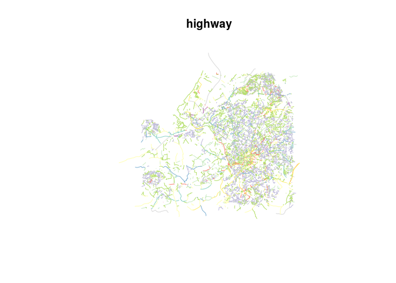

Modelling Cycling Update
================
Robin Lovelace
8 May 2017

-   [Input data](#input-data)
-   [Modelling raw cyclist counts](#modelling-raw-cyclist-counts)
-   [Boosted regression trees](#boosted-regression-trees)
-   [A full model](#a-full-model)
-   [Fitting to the proportion cycling](#fitting-to-the-proportion-cycling)
-   [Geographically inferred quietness](#geographically-inferred-quietness)

This document reports on methods and preliminary findings associated with the modelling of cycling uptake associated with infrastructure.

Input data
----------

The first stage is to load region-specific data. Eventually these will cover any region, e.g. as specified by the region variable and selected from an appropriate data source:

``` r
region_name = "avon"
data_source = "https://github.com/npct/pct-data/raw/master/"
```

For the case study region of Bristol, the data is stored in the `example-data` folder:

``` r
library(sf)
library(tidyverse)
region = st_read("areas/bristol-poly.geojson")
```

The input data comes from 3 main sources:

-   Outputs from the PCT, which reports current cycling levels and estimated 'fastest routes' for cyclists. After combining the straight lines, quietest routes and fastest routes into a single list object, they can be loaded as follows:

``` r
lfq = readRDS("../example-data/bristol/lfq.Rds")
# plot(lfq$l[6])
# plot(lfq$rf[1], add = T, col = "red")
# plot(lfq$rq[1], add = T, col = "green")
# plot(region[1], col = "white", lwd = 5, add = T)
```

-   OSM data, which can be downloaded using the osmdata R package. We have saved the osm route network already:

``` r
osm_data = readRDS("../example-data/bristol/osm-all-highways.Rds")
ways = osm_data$osm_lines
ways$osm_id = as.integer(as.character(ways$osm_id))
sel = sample(nrow(ways), 10000)
plot(ways[sel, "highway"])
```



-   Data created by the CyIPT project, which provides data on the current road network from the perspective of cycling, including:

``` r
# Quietness
quietness = readr::read_csv("input-data/scorings/bristol.csv")
ways = left_join(ways, quietness, by = c("osm_id" = "id"))
```

``` r
# PCU
pcu = readr::read_csv("trafficcounts/trafficcounts-osm.csv")
```

    ## Parsed with column specification:
    ## cols(
    ##   osm_id = col_integer(),
    ##   aadt = col_double()
    ## )

``` r
ways = left_join(ways, pcu)
```

    ## Joining, by = "osm_id"

``` r
summary(ways$aadt)
```

    ##    Min. 1st Qu.  Median    Mean 3rd Qu.    Max.    NA's 
    ##     160   13111   18448   23150   24755  108091   27894

These can be visualised as follows, with a sample of 5 routes overlaid on a sample of 1000 OSM line elements:

``` r
plot(ways[sel, "quietness"])
plot(lfq$l[1:5, 6], add = T, col = "black")
plot(lfq$rf[1:5, 6], add = T, col = "red", lwd = 3)
plot(lfq$rq[1:5, 6], add = T, col = "green")
```


We can join the relevant variables from the `rf` and `rq` objects onto `l` for modelling:

``` r
names(lfq$rf)
```

    ##  [1] "length"      "time"        "waypoint"    "co2_saving"  "calories"   
    ##  [6] "busyness"    "id"          "change_elev" "av_incline"  "geometry"

``` r
rf = transmute(lfq$rf, dist_fast = length / 1000, time_fast = time, busyness_fast = busyness, av_incline_fast = av_incline) 
st_geometry(rf) <- NULL

rq = transmute(lfq$rq, dist_quiet = length / 1000, time_quiet = time, busyness_quiet = busyness, av_incline_quiet = av_incline) 
st_geometry(rq) <- NULL
l = bind_cols(lfq$l, rf, rq)
```

We can also join segment-level data to routes. This is done for one route as follows:

``` r
route_single = lfq$rf[1,]
ways_touching = ways[route_single,]
```

    ## although coordinates are longitude/latitude, it is assumed that they are planar

``` r
source("R/geobuffer.R")
ways$length = geo_projected(ways, st_length) %>% as.numeric()
```

    ## Running function on a temporary projected version of the Spatial object using the CRS: +proj=aeqd +lat_0=-2.60742267299308 +lon_0=-2.60742267299308 +x_0=0 +y_0=0 +ellps=WGS84 +units=m +no_defs

We can also join all lines that overlap (rather than just touch) the route, but this introduces a buffer whose width must be set and removes some routes that may be relevant to the junctions:

``` r
sel_overlap = st_relate(x = ways, route_single) # fails to find centrelines
```

    ## although coordinates are longitude/latitude, it is assumed that they are planar

``` r
summary(sel_overlap)
```

    ##          V1       
    ##  0F1FF0102:   50  
    ##  FF1FF0102:28785

``` r
route_sp = as(object = route_single, Class = "Spatial")
route_buff_sp = stplanr::buff_geo(route_sp, 100)
```

    ## Transforming to CRS +proj=aeqd +lat_0=51.43314781 +lon_0=-2.51576802 +x_0=0 +y_0=0 +ellps=WGS84

    ## Running function on a temporary projected version of the Spatial object using the CRS: +proj=aeqd +lat_0=51.43314781 +lon_0=-2.51576802 +x_0=0 +y_0=0 +ellps=WGS84

``` r
route_buff = as(object = route_buff_sp, "sf")
sel_overlap = st_within(ways_touching, route_buff, sparse = FALSE)[,1]
```

    ## although coordinates are longitude/latitude, it is assumed that they are planar

``` r
ways_overlap = ways_touching[sel_overlap,]

plot(route_single[1], lwd = 50)
# plot(ways, add = T)
plot(ways_overlap, add = T, lwd = 30, col = "white")
plot(ways_touching, add = T, lwd = 5)
plot(route_buff, add = T)
```


Summary statistics can be pulled from the the results as follows:

``` r
mean(ways_touching$quietness, na.rm = T)
```

    ## [1] 67.45652

``` r
# depreciated version
source("https://raw.githubusercontent.com/r-spatial/sf/752c12eae34efe734d70ebbc420b99d90cbcc5ef/R/join.R")
stjoin_old = st_join
rm(list = ls(pattern = "_join"))
```

We can run this for all routes as follows:

``` r
# for(i in 1:nrow(l))
#   l$quietness[i] = mean(ways[lfq$rf[i,],]$quietness, na.rm = T) ; print(i)
summary(ways$quietness)
ways_no_quiet = filter(ways, !is.na(quietness))
l_joined = st_join(lfq$rf, ways_no_quiet["quietness"], FUN = mean) # old way
l$quietness = l_joined$quietness
# sel_intersects = st_intersects(ways_no_quiet, lfq$rf) # takes some time!
# length(sel_intersects)
# find mean busyness for each 
# head(sel_intersects)
# head(unlist(sel_intersects))
ways_pcu = filter(ways, !is.na(aadt))
l_pcu = st_join(lfq$rf, ways_pcu["aadt"], FUN = mean)
l$aadt = l_pcu$aadt

cor(l$busyness_fast, l$quietness, use = "complete.obs")
busyness_by_length = l$busyness_fast / l$dist /1000
cor(busyness_by_length, l$quietness, use = "complete.obs")
cor(l$quietness, l$aadt, use = "complete.obs")
# idea: use a buffer
saveRDS(l, "../example-data/bristol/l_cyipt.Rds")
```

The results show the quietness score is related to the 'busynance' of the route provided by CycleStreets.net:

``` r
busyness_by_length = l$busyness_fast / l$dist /1000
plot(busyness_by_length, l$quietness)
```


``` r
cor(busyness_by_length, l$quietness, use = "complete.obs")
```

    ## [1] -0.628843

Modelling raw cyclist counts
----------------------------

In the propensity to cycle tool, we modelled cycling uptake in terms of `pcycle`, the percentage cycling.

In this section we will estimate the number cycling directly and use inference about the impact of the route network to estimate uptake, using a wide range of variables.

``` r
names(l)
```

    ##  [1] "is_two_way"               "dist"                    
    ##  [3] "id"                       "msoa1"                   
    ##  [5] "msoa2"                    "all"                     
    ##  [7] "light_rail"               "train"                   
    ##  [9] "bus"                      "taxi"                    
    ## [11] "motorbike"                "car_driver"              
    ## [13] "car_passenger"            "bicycle"                 
    ## [15] "foot"                     "other"                   
    ## [17] "govtarget_slc"            "govtarget_sic"           
    ## [19] "govtarget_slw"            "govtarget_siw"           
    ## [21] "govtarget_sld"            "govtarget_sid"           
    ## [23] "gendereq_slc"             "gendereq_sic"            
    ## [25] "gendereq_slw"             "gendereq_siw"            
    ## [27] "gendereq_sld"             "gendereq_sid"            
    ## [29] "dutch_slc"                "dutch_sic"               
    ## [31] "dutch_slw"                "dutch_siw"               
    ## [33] "dutch_sld"                "dutch_sid"               
    ## [35] "ebike_slc"                "ebike_sic"               
    ## [37] "ebike_slw"                "ebike_siw"               
    ## [39] "ebike_sld"                "ebike_sid"               
    ## [41] "base_sldeath_webtag"      "base_slvalue_webtag"     
    ## [43] "govtarget_sldeath_webtag" "govtarget_slvalue_webtag"
    ## [45] "govtarget_sideath_webtag" "govtarget_sivalue_webtag"
    ## [47] "gendereq_sldeath_webtag"  "gendereq_slvalue_webtag" 
    ## [49] "gendereq_sideath_webtag"  "gendereq_sivalue_webtag" 
    ## [51] "dutch_sldeath_webtag"     "dutch_slvalue_webtag"    
    ## [53] "dutch_sideath_webtag"     "dutch_sivalue_webtag"    
    ## [55] "ebike_sldeath_webtag"     "ebike_slvalue_webtag"    
    ## [57] "ebike_sideath_webtag"     "ebike_sivalue_webtag"    
    ## [59] "base_sldeath_heat"        "base_slvalue_heat"       
    ## [61] "govtarget_sldeath_heat"   "govtarget_slvalue_heat"  
    ## [63] "govtarget_sideath_heat"   "govtarget_sivalue_heat"  
    ## [65] "gendereq_sldeath_heat"    "gendereq_slvalue_heat"   
    ## [67] "gendereq_sideath_heat"    "gendereq_sivalue_heat"   
    ## [69] "dutch_sldeath_heat"       "dutch_slvalue_heat"      
    ## [71] "dutch_sideath_heat"       "dutch_sivalue_heat"      
    ## [73] "ebike_sldeath_heat"       "ebike_slvalue_heat"      
    ## [75] "ebike_sideath_heat"       "ebike_sivalue_heat"      
    ## [77] "base_slco2"               "govtarget_slco2"         
    ## [79] "govtarget_sico2"          "gendereq_slco2"          
    ## [81] "gendereq_sico2"           "dutch_slco2"             
    ## [83] "dutch_sico2"              "ebike_slco2"             
    ## [85] "ebike_sico2"              "geometry"                
    ## [87] "dist_fast"                "time_fast"               
    ## [89] "busyness_fast"            "av_incline_fast"         
    ## [91] "dist_quiet"               "time_quiet"              
    ## [93] "busyness_quiet"           "av_incline_quiet"        
    ## [95] "quietness"                "aadt"

The simplest model of cycling update under this framework would be to estimate the number of cyclists as a linear function of total number travelling:

``` r
m1 = lm(formula = bicycle ~ all, data = l)
summary(m1)
```

    ## 
    ## Call:
    ## lm(formula = bicycle ~ all, data = l)
    ## 
    ## Residuals:
    ##     Min      1Q  Median      3Q     Max 
    ## -85.848  -1.303   0.810   1.810 159.264 
    ## 
    ## Coefficients:
    ##              Estimate Std. Error t value Pr(>|t|)    
    ## (Intercept) -3.169114   0.160791  -19.71   <2e-16 ***
    ## all          0.131082   0.001371   95.58   <2e-16 ***
    ## ---
    ## Signif. codes:  0 '***' 0.001 '**' 0.01 '*' 0.05 '.' 0.1 ' ' 1
    ## 
    ## Residual standard error: 8.001 on 3372 degrees of freedom
    ## Multiple R-squared:  0.7304, Adjusted R-squared:  0.7303 
    ## F-statistic:  9137 on 1 and 3372 DF,  p-value: < 2.2e-16

``` r
(rmse1 = sqrt(c(crossprod(m1$residuals)) / nrow(l)))
```

    ## [1] 7.998234

Already, over half of the number of cyclists using roads can be modelled based on the total number of commuters alone, but we're not capturing any of the variability in the proportion cycling.

The impact of adding distance can be isolated in the linear term as follows:

``` r
m2 = lm(formula = bicycle ~ dist + all, data = l)
summary(m2)
```

    ## 
    ## Call:
    ## lm(formula = bicycle ~ dist + all, data = l)
    ## 
    ## Residuals:
    ##     Min      1Q  Median      3Q     Max 
    ## -85.401  -1.350   0.788   1.943 159.761 
    ## 
    ## Coefficients:
    ##              Estimate Std. Error t value Pr(>|t|)    
    ## (Intercept) -2.744940   0.319685  -8.586   <2e-16 ***
    ## dist        -0.044669   0.029099  -1.535    0.125    
    ## all          0.130425   0.001436  90.802   <2e-16 ***
    ## ---
    ## Signif. codes:  0 '***' 0.001 '**' 0.01 '*' 0.05 '.' 0.1 ' ' 1
    ## 
    ## Residual standard error: 7.999 on 3371 degrees of freedom
    ## Multiple R-squared:  0.7306, Adjusted R-squared:  0.7305 
    ## F-statistic:  4571 on 2 and 3371 DF,  p-value: < 2.2e-16

``` r
(rmse2 = sqrt(c(crossprod(m2$residuals)) / nrow(l)))
```

    ## [1] 7.99544

Note that the fit has improved, but only very slightly. This is partly because only a linear function of distance is used and it does not interact with `all`. Let's simulate that interaction.

So we can fit an interaction term:

``` r
m3 = lm(formula = bicycle ~ all + dist:all, data = l)
summary(m3)
```

    ## 
    ## Call:
    ## lm(formula = bicycle ~ all + dist:all, data = l)
    ## 
    ## Residuals:
    ##      Min       1Q   Median       3Q      Max 
    ## -101.386   -0.957    0.533    1.511  158.567 
    ## 
    ## Coefficients:
    ##               Estimate Std. Error t value Pr(>|t|)    
    ## (Intercept) -1.7684707  0.1696349  -10.43   <2e-16 ***
    ## all          0.1519905  0.0017050   89.14   <2e-16 ***
    ## all:dist    -0.0071616  0.0003765  -19.02   <2e-16 ***
    ## ---
    ## Signif. codes:  0 '***' 0.001 '**' 0.01 '*' 0.05 '.' 0.1 ' ' 1
    ## 
    ## Residual standard error: 7.604 on 3371 degrees of freedom
    ## Multiple R-squared:  0.7566, Adjusted R-squared:  0.7564 
    ## F-statistic:  5238 on 2 and 3371 DF,  p-value: < 2.2e-16

``` r
(rmse3 = sqrt(c(crossprod(m3$residuals)) / nrow(l)))
```

    ## [1] 7.600695

``` r
plot(l$all, l$bicycle)
points(l$all, m1$fitted.values, col = "red")
points(l$all, m3$fitted.values, col = "grey")
```


There are various issues here. We need to model cycling uptake but that is always a function of `all`. We must add additional variables such as hilliness. Further, we must use non-linear function of some predictor variables such as distance.

The mission is to improve this fit to account for the impact of infrastructure so we can model cycling uptake when the road network changes.

This is where machine learning can come in.

Boosted regression trees
------------------------

Machine learning can provide a way to extract knowledge from the input data. An implementation is provided by the **xgboost** package:

``` r
st_geometry(l) = NULL # remove geometry cols
library(xgboost)
```

    ## 
    ## Attaching package: 'xgboost'

    ## The following object is masked from 'package:dplyr':
    ## 
    ##     slice

``` r
set.seed(2017)
l_sub = select(l, bicycle, dist, all)
xgboost(data = as.matrix(l_sub[-1]), label = l_sub$bicycle, nrounds = 5)
```

    ## [1]  train-rmse:12.223766 
    ## [2]  train-rmse:9.560989 
    ## [3]  train-rmse:7.688505 
    ## [4]  train-rmse:6.360555 
    ## [5]  train-rmse:5.424933

    ## ##### xgb.Booster
    ## raw: 13.4 Kb 
    ## call:
    ##   xgb.train(params = params, data = dtrain, nrounds = nrounds, 
    ##     watchlist = watchlist, verbose = verbose, print_every_n = print_every_n, 
    ##     early_stopping_rounds = early_stopping_rounds, maximize = maximize, 
    ##     save_period = save_period, save_name = save_name, xgb_model = xgb_model, 
    ##     callbacks = callbacks)
    ## params (as set within xgb.train):
    ##   silent = "1"
    ## xgb.attributes:
    ##   niter
    ## callbacks:
    ##   cb.print.evaluation(period = print_every_n)
    ##   cb.evaluation.log()
    ##   cb.save.model(save_period = save_period, save_name = save_name)
    ## niter: 5
    ## evaluation_log:
    ##     iter train_rmse
    ##        1  12.223766
    ##        2   9.560989
    ## ---                
    ##        4   6.360555
    ##        5   5.424933

``` r
train = l_sub %>% 
    sample_frac(size = 0.5)
```

Note that the RMSE has been more than halved by the use of machine learning. The method's compatibility with the `predict()` function allows us to model uptake of cycling when conditions change. As a hypothetical example, imagine that all people moved 50%.

Rather than fitting on the complete dataset, we'll build the model on a subset (`train`):

``` r
m4 = xgboost(data = as.matrix(train[-1]), label = train$bicycle, nrounds = 5, max_depth = 3)
```

    ## [1]  train-rmse:11.342885 
    ## [2]  train-rmse:9.367547 
    ## [3]  train-rmse:7.962751 
    ## [4]  train-rmse:6.898021 
    ## [5]  train-rmse:6.164511

``` r
m4_fitted = predict(m4, as.matrix(l_sub[-1]))
plot(l$all, l$bicycle)
points(l$all, m4_fitted, col = "red")
```


``` r
(rmse4 = sqrt(c(crossprod(m4_fitted - l_sub$bicycle)) / nrow(l)))
```

    ## [1] 8.356759

We can query the model results to explore the feature importance:

``` r
importance_m4 = xgb.importance(model = m4, feature_names = names(l_sub)[-1])
xgb.plot.importance(importance_m4)
```


A full model
------------

To specify a full model is relatively easy, building on the existing framework (and training against the full dataset):

``` r
l_full = mutate(l, bicycle, all, dist, cirquity = dist_fast / dist, qdf = dist_quiet / dist_fast, av_incline_fast, busyness_fast = busyness_fast / dist, busyness_quiet = busyness_quiet / dist, aadt)
l_full = select(l_full, bicycle, all, dist, cirquity, qdf, av_incline_fast, busyness_fast, busyness_quiet, aadt)
train = sample_frac(l_full, 1)
m5 = xgboost(data = as.matrix(train[-1]), label = train$bicycle, nrounds = 10, max_depth = 5)
```

    ## [1]  train-rmse:12.201223 
    ## [2]  train-rmse:9.482461 
    ## [3]  train-rmse:7.535289 
    ## [4]  train-rmse:6.118704 
    ## [5]  train-rmse:5.153230 
    ## [6]  train-rmse:4.461695 
    ## [7]  train-rmse:3.977563 
    ## [8]  train-rmse:3.611012 
    ## [9]  train-rmse:3.315060 
    ## [10] train-rmse:3.138710

``` r
importance_m5 = xgb.importance(model = m5, feature_names = names(l_full)[-1])
xgb.plot.importance(importance_m5)
```


``` r
m5_fitted = predict(m5, as.matrix(l_full[-1]))
(rmse5 = sqrt(c(crossprod(m5_fitted - l_full$bicycle)) / nrow(l)))
```

    ## [1] 3.138711

``` r
cor(m5_fitted * l$all, l_full$bicycle)^2
```

    ## [1] 0.7962587

Fitting to the proportion cycling
---------------------------------

We know that `bicycle` is intimately related to `all`. It cannot be higher and is a proportion of it. So instead, we can remove `all` from the equation (the number of people travelling on a route should be independent of their propensity to cycle) and instead to fit to `pcycle`:

``` r
train_df = sample_frac(l_full, 1)
train = as.matrix(train_df[,-c(1, 2)])
m6 = xgboost(data = train, label = train_df$bicycle / train_df$all, nrounds = 10, max_depth = 5, weight = train_df$all)
```

    ## [1]  train-rmse:0.300382 
    ## [2]  train-rmse:0.212606 
    ## [3]  train-rmse:0.152117 
    ## [4]  train-rmse:0.110719 
    ## [5]  train-rmse:0.082872 
    ## [6]  train-rmse:0.064637 
    ## [7]  train-rmse:0.053434 
    ## [8]  train-rmse:0.045947 
    ## [9]  train-rmse:0.041975 
    ## [10] train-rmse:0.039525

``` r
importance_m6 = xgb.importance(model = m6, feature_names = names(l_full)[-c(1, 2)])
xgb.plot.importance(importance_m6)
```


``` r
m6_fitted = predict(m6, as.matrix(l_full[-c(1, 2)]))
(rmse6 = sqrt(c(crossprod(m6_fitted * l$all  - l_full$bicycle)) / nrow(l)))
```

    ## [1] 3.315995

``` r
cor(m6_fitted * l$all, l_full$bicycle)^2
```

    ## [1] 0.9560041

This is an impressive result: more than 95% of the variability in the number of cyclists can be predicted by our model, which includes infrastructure variables such as traffic (AADT) and busynance.

On this foundation we can estimate effectiveness.

Geographically inferred quietness
---------------------------------

This model uses aggregated data from the OSM network which we can modify:

``` r
l_full_all = mutate(l, bicycle, all, dist, cirquity = dist_fast / dist, qdf = dist_quiet / dist_fast, av_incline_fast, quietness, aadt)
l_full = select(l_full_all, bicycle, all, dist, cirquity, qdf, av_incline_fast, quietness, aadt)

train_df = sample_frac(l_full, 1) 
train = as.matrix(train_df[,-c(1, 2)])
m7 = xgboost(data = train, label = train_df$bicycle / train_df$all, nrounds = 10, max_depth = 5, weight = train_df$all)
```

    ## [1]  train-rmse:0.300494 
    ## [2]  train-rmse:0.212862 
    ## [3]  train-rmse:0.152456 
    ## [4]  train-rmse:0.111009 
    ## [5]  train-rmse:0.083210 
    ## [6]  train-rmse:0.065127 
    ## [7]  train-rmse:0.054016 
    ## [8]  train-rmse:0.046889 
    ## [9]  train-rmse:0.042570 
    ## [10] train-rmse:0.040297

``` r
importance_m7 = xgb.importance(model = m7, feature_names = names(l_full)[-c(1, 2)])
xgb.plot.importance(importance_m7)
```


``` r
m7_fitted = predict(m7, as.matrix(l_full[-c(1, 2)]))
(rmse7 = sqrt(c(crossprod(m7_fitted * l$all  - l_full$bicycle)) / nrow(l)))
```

    ## [1] 3.460846

``` r
cor(m7_fitted * l$all, l_full$bicycle)^2
```

    ## [1] 0.9523151

Let's take a look at the impact of the `cycleway` variable:

``` r
ways_cycleway = filter(ways, !is.na(cycleway))
ways_cycleway$length_cycleway = ways_cycleway$length
l_cycleway = stjoin_old(lfq$rf, ways_cycleway["length_cycleway"], FUN = sum)
```

    ## although coordinates are longitude/latitude, it is assumed that they are planar

``` r
summary(l_cycleway$length_cycleway)
```

    ##      Min.   1st Qu.    Median      Mean   3rd Qu.      Max.      NA's 
    ##     4.707   744.415  1576.719  2241.357  3246.620 11875.363       673

``` r
l_full$length_cycleway = l_cycleway$length_cycleway

train_df = sample_frac(l_full, 1) 
train = as.matrix(train_df[,-c(1, 2)])
m8 = xgboost(data = train, label = train_df$bicycle / train_df$all, nrounds = 10, max_depth = 5, weight = train_df$all)
```

    ## [1]  train-rmse:0.300276 
    ## [2]  train-rmse:0.212538 
    ## [3]  train-rmse:0.151812 
    ## [4]  train-rmse:0.110245 
    ## [5]  train-rmse:0.081995 
    ## [6]  train-rmse:0.063700 
    ## [7]  train-rmse:0.051786 
    ## [8]  train-rmse:0.044534 
    ## [9]  train-rmse:0.040109 
    ## [10] train-rmse:0.037633

``` r
importance_m8 = xgb.importance(model = m8, feature_names = names(l_full)[-c(1, 2)])
xgb.plot.importance(importance_m8)
```


``` r
m8_fitted = predict(m8, as.matrix(l_full[-c(1, 2)]))
(rmse8 = sqrt(c(crossprod(m8_fitted * l$all  - l_full$bicycle)) / nrow(l)))
```

    ## [1] 3.10829

``` r
cor(m8_fitted * l$all, l_full$bicycle)^2
```

    ## [1] 0.9615977
