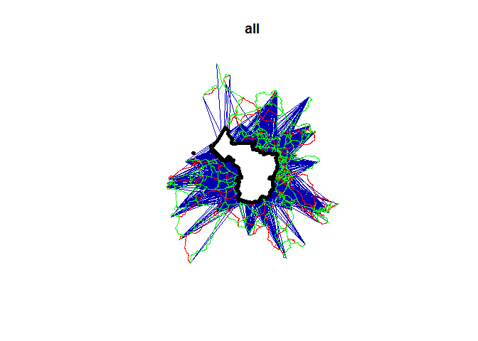
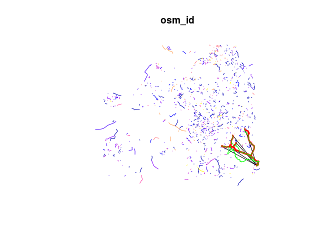

Modelling Cycling Update
================
Robin Lovelace
8 May 2017

This document reports on methods and preliminary findings associated with the modelling of cycling uptake associated with infrastructure.

Input data
----------

The first stage is to load region-specific data. Eventually these will cover any region, e.g. as specified by the region variable and selected from an appropriate data source:

``` r
region_name = "avon"
data_source = "https://github.com/npct/pct-data/raw/master/"
```

For the case study region of Bristol, the data is stored in the `example-data` folder:

``` r
library(sf)
```

    ## Linking to GEOS 3.5.0, GDAL 2.1.1, proj.4 4.9.3

``` r
library(tidyverse)
```

    ## Loading tidyverse: ggplot2
    ## Loading tidyverse: tibble
    ## Loading tidyverse: tidyr
    ## Loading tidyverse: readr
    ## Loading tidyverse: purrr
    ## Loading tidyverse: dplyr

    ## Conflicts with tidy packages ----------------------------------------------

    ## filter(): dplyr, stats
    ## lag():    dplyr, stats

``` r
region = st_read("../areas/bristol-poly.geojson")
```

    ## Reading layer `OGRGeoJSON' from data source `C:\Users\georl\Desktop\GitHub\cyipt\areas\bristol-poly.geojson' using driver `GeoJSON'
    ## Simple feature collection with 1 feature and 21 fields
    ## geometry type:  MULTIPOLYGON
    ## dimension:      XY
    ## bbox:           xmin: -2.773873 ymin: 51.39755 xmax: -2.510999 ymax: 51.54443
    ## epsg (SRID):    4326
    ## proj4string:    +proj=longlat +datum=WGS84 +no_defs

The main input data comes from 2 main sources:

-   Outputs from the PCT, which reports current cycling levels and estimated 'fastest routes' for cyclists. After combining the straight lines, quietest routes and fastest routes into a single list object, they can be loaded as follows:

``` r
lfq = readRDS("../../example-data/bristol/lfq.Rds")
plot(lfq$l[6])
plot(lfq$rf[1], add = T, col = "red")
plot(lfq$rq[1], add = T, col = "green")
plot(region[1], col = "white", lwd = 5, add = T)
```



-   Outputs from the data processing stage of the CyIPT project, which provides data on the current road network from the perspective of cycling.

``` r
osm_lines = readRDS("osm-lines-quietness-full.Rds")
```

These can be visualised as follows, with a sample of 5 routes overlaid on a sample of 1000 OSM line elements:

``` r
plot(osm_lines[sample(x = nrow(osm_lines), size = 1000), 1])
plot(lfq$l[1:5, 6], add = T, col = "black")
plot(lfq$rf[1:5, 6], add = T, col = "red", lwd = 3)
plot(lfq$rq[1:5, 6], add = T, col = "green")
```



We can join the relevant variables from the `rf` and `rq` objects onto `l` for modelling:

``` r
names(lfq$rf)
```

    ##  [1] "length"      "time"        "waypoint"    "co2_saving"  "calories"   
    ##  [6] "busyness"    "id"          "change_elev" "av_incline"  "geometry"

``` r
rf = transmute(lfq$rf, dist_fast = length / 1000, time_fast = time, busyness_fast = busyness, av_incline_fast = av_incline) 
st_geometry(rf) <- NULL

rq = transmute(lfq$rq, dist_quiet = length / 1000, time_quiet = time, busyness_quiet = busyness, av_incline_quiet = av_incline) 
st_geometry(rq) <- NULL
lfq$l = bind_cols(lfq$l, rf, rq)
```

Modelling cycling uptake
------------------------

In the propensity to cycle tool, we modelled cycling uptake in terms of `pcycle`, the percentage cycling.

In CyIPT, we will estimate the number cycling directly and use inference about the impact of the route network to estimate uptake, using a wide range of variables.

``` r
names(lfq$l)
```

    ##  [1] "is_two_way"               "dist"                    
    ##  [3] "id"                       "msoa1"                   
    ##  [5] "msoa2"                    "all"                     
    ##  [7] "light_rail"               "train"                   
    ##  [9] "bus"                      "taxi"                    
    ## [11] "motorbike"                "car_driver"              
    ## [13] "car_passenger"            "bicycle"                 
    ## [15] "foot"                     "other"                   
    ## [17] "govtarget_slc"            "govtarget_sic"           
    ## [19] "govtarget_slw"            "govtarget_siw"           
    ## [21] "govtarget_sld"            "govtarget_sid"           
    ## [23] "gendereq_slc"             "gendereq_sic"            
    ## [25] "gendereq_slw"             "gendereq_siw"            
    ## [27] "gendereq_sld"             "gendereq_sid"            
    ## [29] "dutch_slc"                "dutch_sic"               
    ## [31] "dutch_slw"                "dutch_siw"               
    ## [33] "dutch_sld"                "dutch_sid"               
    ## [35] "ebike_slc"                "ebike_sic"               
    ## [37] "ebike_slw"                "ebike_siw"               
    ## [39] "ebike_sld"                "ebike_sid"               
    ## [41] "base_sldeath_webtag"      "base_slvalue_webtag"     
    ## [43] "govtarget_sldeath_webtag" "govtarget_slvalue_webtag"
    ## [45] "govtarget_sideath_webtag" "govtarget_sivalue_webtag"
    ## [47] "gendereq_sldeath_webtag"  "gendereq_slvalue_webtag" 
    ## [49] "gendereq_sideath_webtag"  "gendereq_sivalue_webtag" 
    ## [51] "dutch_sldeath_webtag"     "dutch_slvalue_webtag"    
    ## [53] "dutch_sideath_webtag"     "dutch_sivalue_webtag"    
    ## [55] "ebike_sldeath_webtag"     "ebike_slvalue_webtag"    
    ## [57] "ebike_sideath_webtag"     "ebike_sivalue_webtag"    
    ## [59] "base_sldeath_heat"        "base_slvalue_heat"       
    ## [61] "govtarget_sldeath_heat"   "govtarget_slvalue_heat"  
    ## [63] "govtarget_sideath_heat"   "govtarget_sivalue_heat"  
    ## [65] "gendereq_sldeath_heat"    "gendereq_slvalue_heat"   
    ## [67] "gendereq_sideath_heat"    "gendereq_sivalue_heat"   
    ## [69] "dutch_sldeath_heat"       "dutch_slvalue_heat"      
    ## [71] "dutch_sideath_heat"       "dutch_sivalue_heat"      
    ## [73] "ebike_sldeath_heat"       "ebike_slvalue_heat"      
    ## [75] "ebike_sideath_heat"       "ebike_sivalue_heat"      
    ## [77] "base_slco2"               "govtarget_slco2"         
    ## [79] "govtarget_sico2"          "gendereq_slco2"          
    ## [81] "gendereq_sico2"           "dutch_slco2"             
    ## [83] "dutch_sico2"              "ebike_slco2"             
    ## [85] "ebike_sico2"              "geometry"                
    ## [87] "dist_fast"                "time_fast"               
    ## [89] "busyness_fast"            "av_incline_fast"         
    ## [91] "dist_quiet"               "time_quiet"              
    ## [93] "busyness_quiet"           "av_incline_quiet"

The simplest model of cycling update under this framework would be to estimate the number of cyclists as a linear function of total number travelling:

``` r
m1 = lm(formula = bicycle ~ all, data = lfq$l)
summary(m1)
```

    ## 
    ## Call:
    ## lm(formula = bicycle ~ all, data = lfq$l)
    ## 
    ## Residuals:
    ##     Min      1Q  Median      3Q     Max 
    ## -85.848  -1.303   0.810   1.810 159.264 
    ## 
    ## Coefficients:
    ##              Estimate Std. Error t value Pr(>|t|)    
    ## (Intercept) -3.169114   0.160791  -19.71   <2e-16 ***
    ## all          0.131082   0.001371   95.58   <2e-16 ***
    ## ---
    ## Signif. codes:  0 '***' 0.001 '**' 0.01 '*' 0.05 '.' 0.1 ' ' 1
    ## 
    ## Residual standard error: 8.001 on 3372 degrees of freedom
    ## Multiple R-squared:  0.7304, Adjusted R-squared:  0.7303 
    ## F-statistic:  9137 on 1 and 3372 DF,  p-value: < 2.2e-16

Already, over half of the number of cyclists using roads can be modelled based on the total number of commuters alone.

The impact of adding distance is shown below:

``` r
m2 = lm(formula = bicycle ~ all + dist, data = lfq$l)
summary(m2)
```

    ## 
    ## Call:
    ## lm(formula = bicycle ~ all + dist, data = lfq$l)
    ## 
    ## Residuals:
    ##     Min      1Q  Median      3Q     Max 
    ## -85.401  -1.350   0.788   1.943 159.761 
    ## 
    ## Coefficients:
    ##              Estimate Std. Error t value Pr(>|t|)    
    ## (Intercept) -2.744940   0.319685  -8.586   <2e-16 ***
    ## all          0.130425   0.001436  90.802   <2e-16 ***
    ## dist        -0.044669   0.029099  -1.535    0.125    
    ## ---
    ## Signif. codes:  0 '***' 0.001 '**' 0.01 '*' 0.05 '.' 0.1 ' ' 1
    ## 
    ## Residual standard error: 7.999 on 3371 degrees of freedom
    ## Multiple R-squared:  0.7306, Adjusted R-squared:  0.7305 
    ## F-statistic:  4571 on 2 and 3371 DF,  p-value: < 2.2e-16

Note that the fit has improved, but only very slightly. This is partly because only a linear function of distance is used. We must use a non-linear function of distance as a predictor.

The mission is to improve this fit to account for the impact of infrastructure so we can model cycling uptake when the road network changes.
