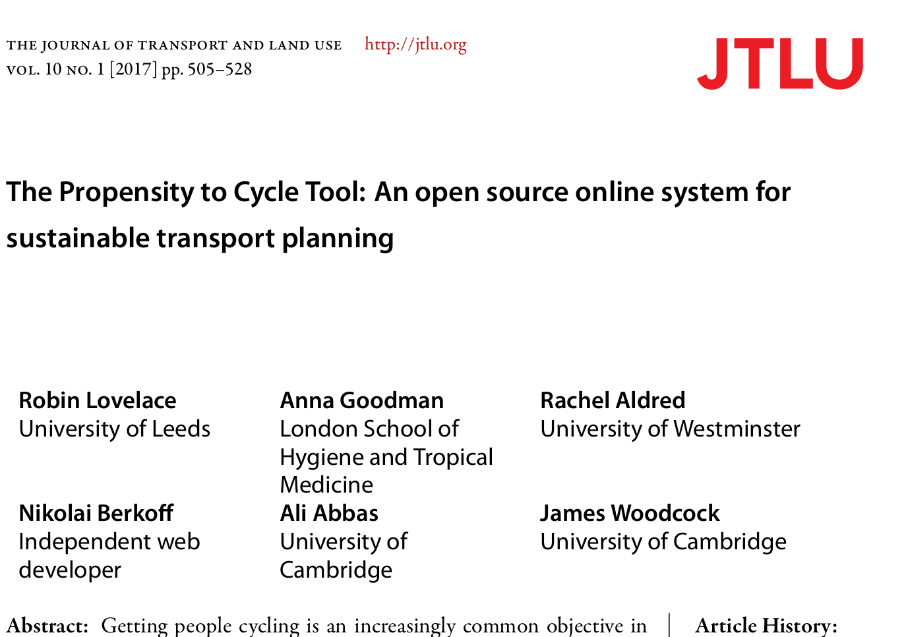

<!-- Plan: 15 minute presentation building on pct work and mlCars stuff -->

## Outline

- Context 
- The Propensity to Cycle Tool
- Tools to prioritise infrastucture

## The scale of the challenge, from this...

```{r, echo=FALSE, out.width="50%", fig.cap="Source: [Brent Toderian](https://twitter.com/BrentToderian)"}
knitr::include_graphics("https://pbs.twimg.com/media/DOH94nXUIAAgcll.jpg")
```

## The costs of the current system

```{r, echo=FALSE, fig.cap="Source: The wider costs of transport (Cabinet Office, [2009](http://webarchive.nationalarchives.gov.uk/+/http:/www.cabinetoffice.gov.uk/media/307739/wider-costs-transport.pdf))", out.width="90%"}
knitr::include_graphics("https://raw.githubusercontent.com/cyipt/cyipt/master/figures/transport-costs.png")
```


## Towards cycling being the natural choice

```{r, echo=FALSE, out.width="70%", fig.cap="Source: [Brent Toderian](https://twitter.com/BrentToderian)"}
knitr::include_graphics("https://pbs.twimg.com/media/DJaWCo0U8AAzQGW.jpg:large")
```

## Problem: evidence overload

```{r, echo=FALSE, out.width="80%"}
knitr::include_graphics("https://larrycuban.files.wordpress.com/2015/02/data-overload-2.jpg")
```

> - Problem is operationalising this data
> - Needs to be provided in a format that can be acted on at the local level

## The Propensity to Cycle Tool - see [w](http://npct0.vs.mythic-beasts.com/shiny_interface/?r=west-yorkshire)[ww.pct.bike](www.pct.bike)

```{r, echo=FALSE, fig.cap="The front page of the open source, open access Propensity to Cycle Tool (PCT).", out.width="80%"}
knitr::include_graphics("~/npct/pct-team/figures/pct-frontpage.png")
```

## Context: from concept to implementation

<!-- Not a rabbit out of a hat! -->
> - 3 years in the making
> - Origins go back further

```
Concept (PhD) -> Job at UoL (2009 - 2013)
 Discovery of R programming and shiny (2013)
  Link-up with Cambridge University and colleagues (2015)
    Implementation on national OD dataset, 700k routes (2016)
      Completed LSOA phase (4 million lines!) (2017)
        PCT Wales commissioned + CyIPT Phase I (2018)
```

 > - 2018: PCT Phase III 
 
- A multi-university project
 
```{r, echo=FALSE, out.width="100%"}
knitr::include_graphics("https://github.com/npct/pct-team/blob/master/figures/pct-metalogo.png?raw=true")
```
 
## The academic landscape [see @lovelace_propensity_2017]

```{r, echo=FALSE, out.width="70%"}

```

## Prior work (source: Lovelace et al. 2017)

```{r, echo=FALSE, message=FALSE}
dft = readr::read_csv("~/npct/pct-team/data-sources/cycle-tools-wide.csv")
dft$Tool = gsub("Permeability Assessment Tool", "PAT", dft$Tool)
knitr::kable(dft[-5, ])
```
 
## Policy feedback

"The PCT is a brilliant example of using Big Data to better plan infrastructure investment. It will allow us to have more confidence that new schemes are built in places and along travel corridors where there is high latent demand."

- Shane Snow: Head of Seamless Travel Team, Sustainable and Acessible Travel Division

"The PCT shows the country’s great potential to get on their bikes, highlights the areas of highest possible growth and will be a useful innovation for local authorities to get the greatest bang for their buck from cycling investments  and realise cycling potential."

- Andrew Jones, Parliamentary Under Secretary of State for Transport

## The PCT in CWIS

Included in Cycling and Walking Infrastructure Strategy (CWIS)

```{r, echo=FALSE, out.width="80%"}
knitr::include_graphics("~/npct/pct-team/figures/front-page-leeds-pct-demo.png")
```

## A model of cycling uptake

```{r, echo=FALSE}
knitr::include_graphics("~/npct/pct-team/flow-model/dd-anna.jpg")
```

- Hilliness and distance are (relatively) unchanging over time
- Model based on polynomial logit model of both:

$$
logit(pcycle) = \alpha + \beta_1 d + \beta_2 d^{0.5} + \beta_3 d^2 + \gamma h + \delta_1 d h + \delta_2 d^{0.5} h
$$
```{r, eval=FALSE}
logit_pcycle = -3.9 + (-0.59 * distance) + (1.8 * sqrt(distance) ) + (0.008 * distance^2)
```

# Tools to prioritise cycling infrastructure. How many cyclists result from a new cycle path?

## At low geographic resolution

- Clear link between infrastructure and uptake, but inconsistent

```{r, echo=FALSE, out.width="70%"}
knitr::include_graphics("../../cyipt-website/images/ttwa-uptake.png")
```

## Why investigate it?

- We can use 'backcasting' to estimate long-term potential under ideal questions
- But transport authorities need forecasts of future uptake
- *From specific interventions* in order to do this
- There is much existing work on this
- But not able to automatically estimate uptake resulting from new infrastructure

> - A $64,000 question

## Breakthrough datasets


## How to model infrastructure -> cycling? | Where to build what?

See: https://www.cyipt.bike (password protected)

```{r, echo=FALSE, fig.show='hold', out.width="50%"}
knitr::include_graphics(c("../../cyipt-website/images/infrastructure/large/lightsegregation.jpg", "../../cyipt-website/images/recommended.png"))
```

<!-- ## Abstract I -->

<!-- This talk will provide an overview of the work that Robin Lovelace and Malcolm Morgan (ITS) have been doing as part of their Department for Transport funded projects on the Propensity to Cycle Tool (PCT, which has become part of UK government policy in the [Cycling and Walking Infrastructure Strategy](https://www.gov.uk/government/publications/cycling-and-walking-investment-strategy)) and follow-on work on the Cycling Infrastructure Prioritisation Toolkit (CyIPT). -->
<!-- Although strong evidence shows that infrastructure usually precedes (and to some extent causes) behaviour change the starting point of the talk will be behaviour: how do people currently get around and how could it be different, based on the fundamentals of route distance and hilliness. -->
<!-- Robin will demonstrate the PCT in action, talk about the R package **stplanr** that he developed to develop it, and outline plans for a globally scalable transport planning toolkit that builds on the PCT work. -->

<!-- ## Abstract II -->

<!-- Following this high-level overview Malcolm will zoom into the detail: How the CyIPT identifies the best places for infrastructure change and what that infrastructure should be. He will also talk about the advanced programming techniques needed to process such complex geospatial network data at city to national levels.  -->

<!-- There is a clear linkage between the behaviour and infrastructure focci of Robin and Malcolm's talks that will become aparent as the seminar progresses. -->

<!-- Links to check before the talk: -->

## Thanks + links!

- The PCT in action: http://www.pct.bike/
- A prototype of the CyIPT: http://cyipt.bike/
- A paper on the PCT (Lovelace et al 2017): https://www.jtlu.org/index.php/jtlu/article/view/862
- An article explaining **stplanr** (for people interested in the tech): https://cran.r-project.org/web/packages/stplanr/vignettes/introducing-stplanr.html
