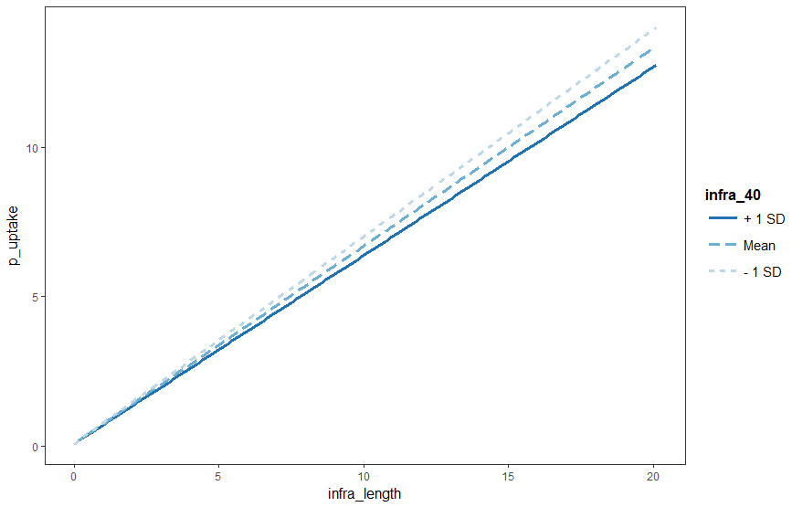

<!-- Plan: 15 minute presentation building on pct work and mlCars stuff -->

# Methods 

## Modelling cycling uptake

```{r, echo=FALSE}
knitr::include_graphics("~/npct/pct-team/flow-model/dd-anna.jpg")
```

- Hilliness and distance are (relatively) unchanging over time
- Model based on polynomial logit model of both:

$$
logit(pcycle) = \alpha + \beta_1 d + \beta_2 d^{0.5} + \beta_3 d^2 + \gamma h + \delta_1 d h + \delta_2 d^{0.5} h
$$
```{r, eval=FALSE}
logit_pcycle = -3.9 + (-0.59 * distance) + (1.8 * sqrt(distance) ) + (0.008 * distance^2)
```

## Adding infrastructure - at low geographic resolution

- Clear link between infrastructure and uptake, but inconsistent

```{r, echo=FALSE, out.width="70%"}
knitr::include_graphics("../../cyipt-website/images/ttwa-uptake.png")
```
## Breakthrough datasets


## Relationship between hard and soft policies

```{r, echo=FALSE, out.width="70%"}

```

## Results

See: https://www.cyipt.bike (password protected)

```{r, echo=FALSE, fig.show='hold', out.width="50%"}
knitr::include_graphics(c("../../cyipt-website/images/infrastructure/large/lightsegregation.jpg", "../../cyipt-website/images/recommended.png"))
```

## Next steps - methods

- Create new explanatory variables
  - Infrastructure on different route options - not just fastest
  - Socio-demographic variables - which people respond
  - Better road traffic data
  - HGV exposure in particular (Ordnance Survey)
  - Street lighting (links with Sheffield and EPSRC)
  
- Re-run model with confidence intervals

## Integrating walking and cycling models 

- Advantages of creating Integrated Cycling and Walking Infrastructure Prioritisation Toolkit (ICWIPT)
    - Mitigates against tool overload
    - Encourages integrated thinking - symbiosis
    - Expertise from route network models [@cooper_testing_2018; @cooper_predictive_2018]

## References

- The PCT in action: http://www.pct.bike/
- A prototype of the CyIPT: http://cyipt.bike/
