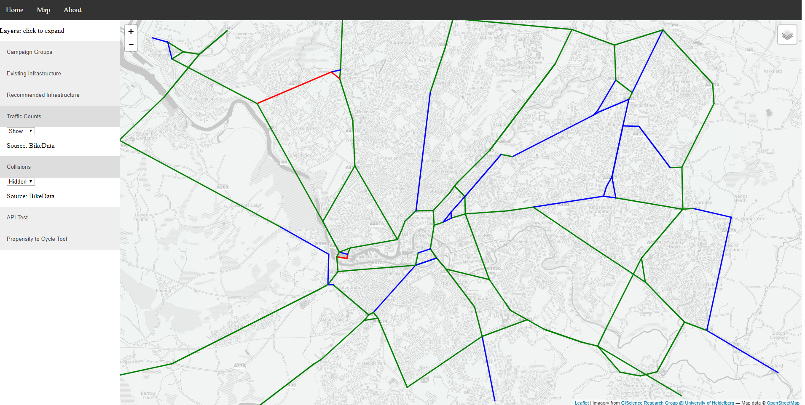

## The scale of the challenge, from this...

```{r setup, include = FALSE}
options(htmltools.dir.version = FALSE)
library(RefManageR)
BibOptions(check.entries = FALSE, 
           bib.style = "authoryear", 
           cite.style = 'alphabetic', 
           style = "markdown",
           first.inits = FALSE,
           hyperlink = FALSE, 
           dashed = FALSE)
my_bib = ReadBib("/home/robin/h/allrefs.bib", check = FALSE)
```

```{r, echo=FALSE, eval=FALSE}
# save pdf
webshot::webshot("slides/open-tools-lida.html", "/tmp/open-tools-lida.pdf")
```

.pull-left[


```{r, echo=FALSE, out.width="100%"}
knitr::include_graphics("https://pbs.twimg.com/media/DOH94nXUIAAgcll.jpg")
```

]

.pull-right[

Source: [Brent Toderian](https://twitter.com/BrentToderian)

Any ideas which city this is?

]
---

## Towards cycling being the natural choice

```{r, echo=FALSE, out.width="80%", fig.cap=""}
knitr::include_graphics("https://pbs.twimg.com/media/DJaWCo0U8AAzQGW.jpg:large")
```

Source: [Brent Toderian](https://twitter.com/BrentToderian)

---

## Problem: evidence overload

```{r, echo=FALSE, out.width="70%"}
knitr::include_graphics("https://larrycuban.files.wordpress.com/2015/02/data-overload-2.jpg")
```

--

- Challenge: operationalising this data

--

- Needs to be provided in 'actionable' format

--

- Requires skills + infrastructure

---

## A case study of an actionable tool: [w](http://npct0.vs.mythic-beasts.com/shiny_interface/?r=west-yorkshire)[ww.pct.bike](www.pct.bike)

```{r, echo=FALSE, fig.cap="The front page of the open source, open access Propensity to Cycle Tool (PCT).", out.width="80%"}
knitr::include_graphics("~/npct/pct-team/figures/pct-frontpage.png")
```

---

## Give it a spin online

- See http://www.pct.bike/
- And https://www.cyipt.bike

```{r}

```

---

## Building the web application

- Started by writing various messy scripts

--


--

But soon that became unsustainable

---

## Developing stplanr

- With support from colleagues in LIDA I created **stplanr**, which works like this (after you have installed R):

```{r}
library(stplanr)
r = route_cyclestreet(
  from = "Chapeltown, Leeds",
  to = "University of Leeds"
  )
r
```

---

## Visualising the results

.pull-left[


- Thanks to existing open source tools for visualisation, we can plot this, e.g. with:

```{r}
library(leaflet)
m = leaflet() %>% 
  addTiles() %>% 
  addPolylines(data = r) %>% 
  addMiniMap() %>% 
  addScaleBar()
```

]

.pull-right[

```{r, out.width="100%", out.height="400"}
m
```

]
---

## Capabilities of stplanr

.pull-left[

- Convert origin-destination pairs into geographic lines

Example datasets in **stplanr**

Centroids (open access data):

```{r}
head(cents_sf[1], 3)
```

]

.pull-right[

### Origin-destination (OD) pairs

```{r}
head(flow[c(1:3)], 2)
```

]

---

## Making tabular data spatial


Conversion to a spatial object with **stplanr**


```{r}
l = od2line(flow, cents_sf)
sf:::plot.sf(l[3:5], lwd = l$All / mean(l$All))
```

---

## Interactive visualisation is key

.pull-left[


- Previous plot is not particularly revealing 

- Another visualisation will help

```{r}
library(tmap)
l$pwalk = l$On.foot / l$All
m2 = tm_shape(l) +
  tm_lines(
    "pwalk",
    lwd = "All",
    scale = 10,
    palette = "RdYlBu")
```

]

.pull-right[

- Make the data come alive

```{r, out.width="100%", out.height=400, message=FALSE}
tmap_leaflet(m2)
```

]

---

## Ensuring impact

See https://twitter.com/robinlovelace/status/907261128354488320

<blockquote class="twitter-tweet" data-lang="en"><p lang="en" dir="ltr">Scenario of cycling infrastructure in Leeds: <a href="https://t.co/FqehV7kAjc">https://t.co/FqehV7kAjc</a> Prelim. cost: ~£120m (without junction remodelling) for 157 km. <a href="https://twitter.com/hashtag/CyIPT?src=hash&amp;ref_src=twsrc%5Etfw">#CyIPT</a> <a href="https://t.co/OHqC8axut5">pic.twitter.com/OHqC8axut5</a></p>&mdash; Robin Lovelace (robinlovelace) <a href="https://twitter.com/robinlovelace/status/907261128354488320?ref_src=twsrc%5Etfw">September 11, 2017</a></blockquote>
<script async src="https://platform.twitter.com/widgets.js" charset="utf-8"></script>

---

## Deployment

- Live demo at http://www.pct.bike/
- Get policy makers interested

--

```{r, echo=FALSE}
knitr::include_graphics("https://raw.githubusercontent.com/npct/pct-team/master/figures/front-page-leeds-pct-demo.png")
```

---

## Links + references

> - Contact: project info@cyipt.bike, me: r.lovelace@leeds.ac.uk

- If you want to code in R 4 transport, start here: https://geocompr.robinlovelace.net/spatial-class.html
- The PCT in action: http://www.pct.bike/
- A prototype of the CyIPT: http://cyipt.bike/
- Resource on R for transport: http://geocompr.robinlovelace.net/transport.html

Citation

Lovelace, R., Goodman, A., Aldred, R., Berkoff, N., Abbas, A., Woodcock, J., 2017. The Propensity to Cycle Tool: An open source online system for sustainable transport planning. Journal of Transport and Land Use 10. https://doi.org/10.5198/jtlu.2016.862

