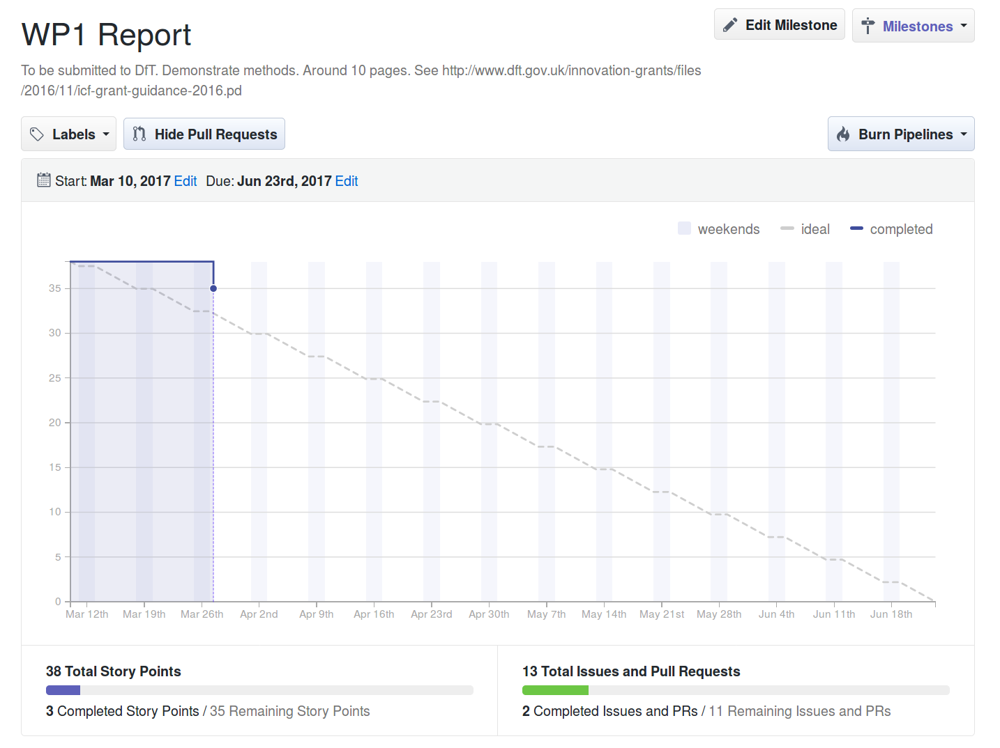

```{r, echo=FALSE}
knitr::opts_chunk$set(echo = FALSE)
```

This report provides a brief update on the status of the Cycling Infrastructure Prioritisation Toolkit (CyIPT) following an initial meeting on 2017-03-10.

Overall we have made rapid progress. We have set-up a GitHub team at https://github.com/cyipt to track the issues we'll be working on and a project management work-flow to ensure all deliverables are met on time (see Figure 1).

```{r, fig.cap="Burndown chart tracking progress towards delivery of Progress Report 1. See https://github.com/cyipt.", out.width="70%"}

```


## Breakdown of WP1

Based on a set of questions (see [github.com/cyipt/cyipt/issues/2](https://github.com/cyipt/cyipt/issues/2)) We have added sub-tasks to initial breakdown of tasks for Workpackage 1 (WP1), as follows:

- Collate and clean data
    - Identify and characterise case study cities (see issue [13](https://github.com/cyipt/cyipt/issues/13))
    - Evaluate relative merits of OSM and Ordnance Survey data ([16](https://github.com/cyipt/cyipt/issues/16))
    - Develop code to download all current cycling infrastructure (see 9 and [10](https://github.com/cyipt/cyipt/issues/10))

- [Classification](https://github.com/cyipt/cyipt/issues/4) of barriers
    - Develop typology of barrier types 
    - Develop method to segment roads ([17](https://github.com/cyipt/cyipt/issues/17) and  [12](https://github.com/cyipt/cyipt/issues/12))
    - Find bus route data ([1](https://github.com/cyipt/cyipt/issues/1))
    
    
- Filtering of barriers
    - By level of cycling potential
    - By feasibility (road widths)

- Identify interventions
    - By intervention type (depends on #4)
    - Represent improvement on route network (e.g. by adding cycleway=true)

- Cost estimation
    - [Create dataset of typical costs](https://github.com/cyipt/cyipt/issues/15)
    
- Effectiveness estimation
  - Develop method to re-run model for each intervention
  - Assign uptake per intervention

## Case study areas

The following case study areas have been selected

- A small area surrounding a road with low levels of cycling and poor provision for cycling (Chapeltown Road, Leeds)
- An area of Cambridge that is well-known to team members to test our methods
- The City of Bristol

We will look to explore these initial case study areas to Nottingham and Coventry. We will remain open to other suggestions for further case study areas and will develop the methods in a way that is generalisable to any region. 


## Next steps

- Meet-up and liaise with other ICF grant-winners and policy makers, 2017-03-29
- Malcolm Morgan to officially commence work on the project at 50% FTE, 2017-04-01, in a contract with UoL that lasts until 2017-03-31
- 'Tech team' meeting in Cambridge, 2017-04-05
- Identify barriers in case study areas
- Develop spreadsheet of costs
- Classify interventions in case study areas
- Develop workflow to estimate cost-benefit ratios
